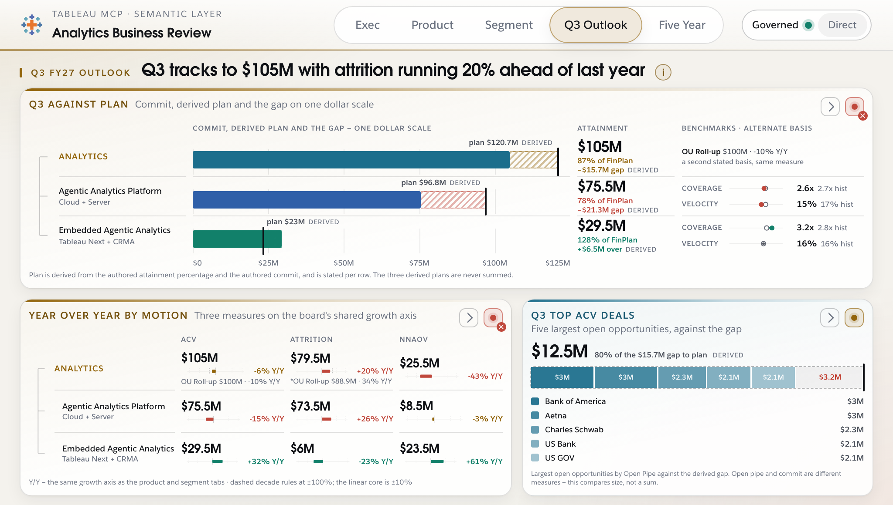
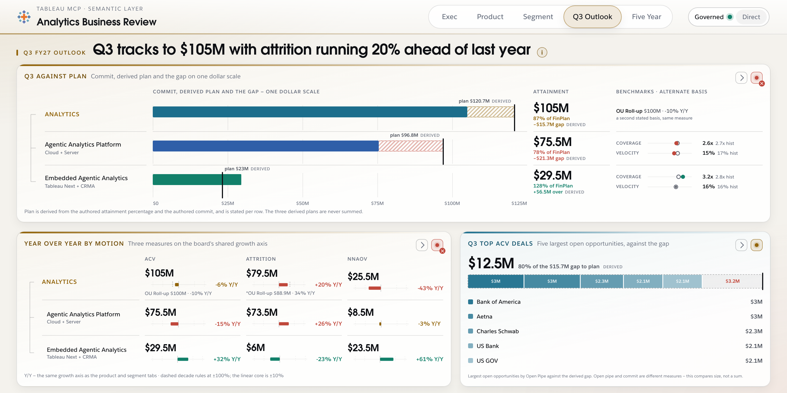
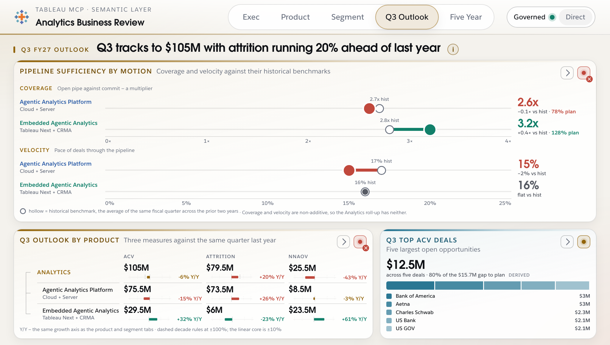
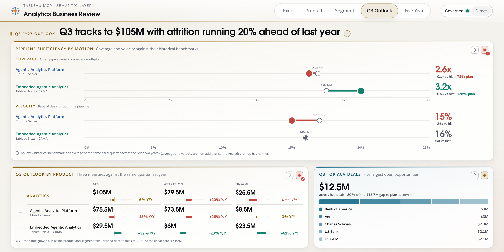
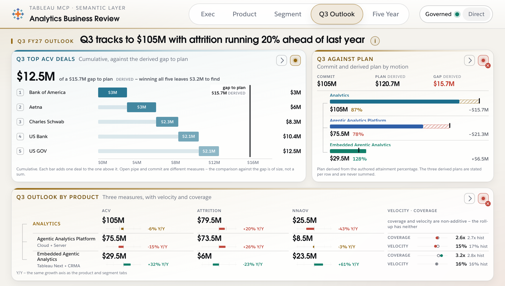
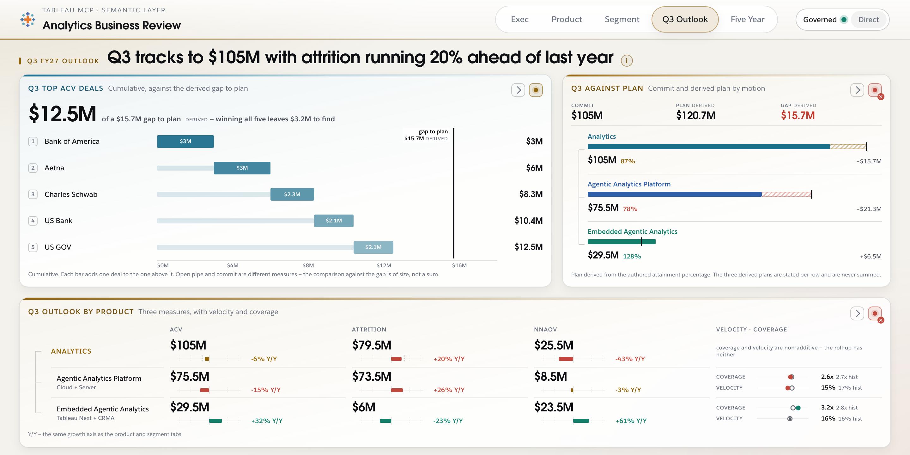

# Q3 Outlook — visualization redesign

Sections 1–8 are the design exploration: three alternatives, each with a
different hero, plus a recommendation and an implementation estimate. They are
left as written. Sections 9–10 record what was chosen — a hybrid of A and B,
which the exploration did not propose — and what was built.

Artefacts:

- `docs/mockups/q3/build.mjs` — generates the mockups. Self-contained: it
  imports nothing from `src/`, and hand-copies the parts of `styles/*.css`
  the card idiom needs. The only shared asset it references is `fonts/`.
- `docs/mockups/q3/alt-a-gap-to-plan.html`, `alt-b-coverage.html`,
  `alt-c-deals.html`, and `alt-a-gap-to-plan-direct.html` (Direct-mode proof).
- `docs/mockups/q3/hybrid-gap-and-benchmark.html` and its `-direct` pair — the
  chosen composition, built in phase 1 to prove both heroes fit above the fold
  before any renderer was written.
- `docs/mockups/q3/shots/*.png` — each at 1024×580 and 1440×720.
- `docs/mockups/q3/shot.sh` — headless-Chrome capture.
- `scripts/verify.sh` — the verification matrix used in phase 2.

Through §8 no shared file was written. The implementation in §10 does write
`data/`, `src/` and `styles/`, on a clean tree, after the concurrent pass on
those files had landed.

---

## 1. Verdict on the five criticisms

**1. The tab says the same three numbers twice — agreed, and it is the biggest
problem.** The head band's three stat tiles and the matrix's Analytics row
carry the identical `$105M / $79.5M / $25.5M`. Worse than redundant: the two
surfaces disagree. The NNAOV tile reads `-41% Y/Y`; the matrix's Analytics
NNAOV cell reads `-43% Y/Y`, on the same dollar figure. Whichever is right,
the tab currently prints both, eight centimetres apart. Deleting the duplicate
surface is not only a layout win, it silently resolves a contradiction the
board is otherwise obliged to render faithfully. All three alternatives delete
the head band. That single move frees ~120px of the ~580px budget, which is
what pays for everything else here.

**2. The deals rail encodes almost nothing — agreed, with a sharper reason
than range.** The 1.4× span is the visible symptom; the real fault is that
length is being spent on the wrong comparison. Two of the five deals are
*tied* at $3M and two more are tied at $2.1M, so a length encoding of rank
mostly renders ties. The quantity that matters is the one the rail never
draws: the five deals sum to **$12.5M**, and the derived gap to plan is
**$15.7M**. Every alternative re-bases the deals against something — the gap
(A, C) or the whole they compose (B) — instead of against each other.

**3. The matrix cells are four encodings in a tiny box — agreed on clutter,
and "No change w/w" is worse than dead area.** It appears on exactly two cells
of nine, so it reads as a property of those two products rather than as an
absence of movement everywhere else. It is week-over-week commentary on a tab
with no week axis. Cut it. On the four-encoding point: the fix is not to
compress but to *separate*. Y/Y and attainment are per-cell measures;
velocity and coverage are per-*row* properties that were being drawn inside a
cell of the ACV column, which is why they read as clutter — they were in the
wrong container. Every alternative pulls them out of the cell.

**4. Velocity and coverage are the smallest marks and the most decision-
relevant — agreed, and the semantic layer makes this decisive.** See §5:
coverage and velocity are the *only* outlook measures on this tab that are
fully governed, benchmark included. They are currently rendered at about 40×10
pixels. This is the criticism that changed my recommendation.

**5. Nothing conveys outlook — agreed on the diagnosis, but the proposed cure
is unavailable.** There is no time axis to add. `board.json` states freshness
as **Jul 28, 2026**, and Q3 FY27 runs August–October, so the tab is standing
at day zero of the quarter: there is no quarter-to-date pace, no burn-up, no
trajectory, because nothing has elapsed yet. A pace chart here would be
fabricated. What *is* available and forward-looking is the pair of questions an
outlook actually turns on — **how far from plan** (derivable exactly) and **is
there enough pipe to cover it** (authored, and governed). All three
alternatives are built on those two rather than on a time axis.

**What the list misses — three additions.**

- **The alternate-basis strings are structural, not footnotes.** Two cells
  carry a second stated value for the same measure: ACV `OU Roll-up $100M
  · -10% Y/Y` against `$105M · -6% Y/Y`, and Attrition `*OU Roll-up $88.9M ·
  34% Y/Y` against `$79.5M · +20% Y/Y`. That is a 5% and an 11.8% disagreement
  on the headline measures, currently set in 8px grey. On a board whose whole
  argument is measure identity, this is a finding, not a caption. Alternatives
  A and B give it a named column.
- **The tab's roll-up is not a sum, and nothing says so.** Platform + Embedded
  NNAOV is `$8.5M + $23.5M = $32M`; the Analytics row says `$25.5M`. Any
  part-to-whole treatment of the matrix — stacked bar, treemap, waterfall —
  would expose that. No alternative here stacks the children. See §6.
- **The headline verb is doing work no mark supports.** "Q3 *tracks to* $105M"
  is a claim about arrival, next to a grid of static values. Alternatives A and
  C put a mark under that verb; B replaces the claim with a sufficiency test,
  which is the more defensible reading.

---

## 2. The derived arithmetic

Percent-of-FinPlan is authored per row, and commit is authored per row, so
plan and gap are exact division. Displayed to one decimal at `$M`, the board's
convention. Every derived figure is tagged `DERIVED` wherever it is drawn.

| Row | Commit (authored) | Attainment (authored) | Plan = commit ÷ attainment | Gap = plan − commit |
|---|---|---|---|---|
| Analytics | $105M | 87% | 105 ÷ 0.87 = **$120.6897M** → `$120.7M` | **$15.6897M** → `−$15.7M` |
| Agentic Analytics Platform | $75.5M | 78% | 75.5 ÷ 0.78 = **$96.7949M** → `$96.8M` | **$21.2949M** → `−$21.3M` |
| Embedded Agentic Analytics | $29.5M | 128% | 29.5 ÷ 1.28 = **$23.0469M** → `$23.0M` | **−$6.4531M** → `+$6.5M over` |

Deals against the Analytics gap:

- Deals total = 3 + 3 + 2.3 + 2.1 + 2.1 = **$12.5M** (matches the authored
  `"$12.5M across five deals"`, so the roll-up is confirmed, not asserted).
- Share of gap = 12.5 ÷ 15.6897 = **79.67%** → `80% of the $15.7M gap`.
- Residual = 15.6897 − 12.5 = **$3.1897M** → `$3.2M to find`.

Two comparisons in these mockups cross measure boundaries, and each is
labelled on the page rather than left implied:

- **Deals versus gap.** The deals are Open Pipe; the gap is derived from a
  commit. Different measures, so the ladder in C and the segmented bar in A
  are captioned *"Open pipe and commit are different measures — the comparison
  is against the gap of size, not a sum."*
- **Coverage and velocity are non-additive** — `semantic-layer.md` §"SUM
  applied to a ratio" is explicit. Hence the Analytics roll-up row carries
  neither in any alternative; the axis in B simply has two marks, not three,
  which renders the rule instead of stating it.

---

## 3. Alternative A — "Gap to plan"

> **Thesis:** the quarter is $15.7M short of plan, here is where the shortfall
> sits by motion, and the five open deals cover four fifths of it.

**Band 1 (hero, full width, ~48%).** `Q3 against plan`. Three rows, one shared
dollar axis 0–$125M. Each row: a solid bar to the commit, a hatched extension
to the derived plan, and a heavy tick at plan. Embedded's bar runs *past* its
tick, so over-plan reads as a different shape, not a different colour. Right of
the plot, two named columns — `ATTAINMENT` (commit, % of FinPlan, signed gap)
and `BENCHMARKS · ALTERNATE BASIS` (coverage and velocity as dumbbells for the
two children; for the Analytics roll-up, the OU Roll-up alternate basis, since
that row has no coverage or velocity to show).

**Band 2 left.** `Year over year by motion` — the 3×3 matrix reduced to two
encodings per cell, the value and the shared symlog Y/Y stub. Attainment has
moved to band 1; velocity and coverage have moved to band 1; `No change w/w` is
gone.

**Band 2 right.** `Q3 top ACV deals` — one bar segmented into the five deals
plus a lighter residual segment, the whole bar being the $15.7M gap. The
question "what do these five deals do to the quarter" is answered by the shape:
they fill most of the bar and leave a visible tail.

Shared-scale bars are the strongest encoding available and this puts the
tab's most consequential quantity on one. The cost is §5.

---

## 4. Alternative B — "Coverage sufficiency"

> **Thesis:** Platform is running below its own historical coverage and
> velocity while carrying the shortfall; Embedded is above both and already
> past plan.

**Band 1 (hero, full width, ~58%).** `Pipeline sufficiency by motion`. Two
shared benchmark axes at hero width — coverage on 0–4×, velocity on 0–25% —
with both motions placed on each. Each mark is a dumbbell: hollow circle at
the historical benchmark, filled circle at current, connecting stem toned by
direction. Embedded's velocity is 16% against a 16% benchmark, which renders
as a single neutral dot with no stem: flat is a shape here, not a sentence.
The readout column carries the value, the signed delta against history, and —
on the coverage axis only — attainment, so "is there enough pipe" and "are we
making plan" are read on one line.

This is a promotion of two marks that are currently about 400 square pixels
each to about 12,000. The comparison also changes kind: currently each
product's coverage is compared only to its own benchmark, four separate
readings. On a shared axis, Platform at 2.6× and Embedded at 3.2× are directly
comparable to each other *and* to their benchmarks at once.

**Band 2.** The compact Y/Y matrix at left, and at right the five deals as a
composition bar — segments proportional within the $12.5M whole, ties
rendering as identical segments — over the derived `80% of the $15.7M gap`.

---

## 5. Alternative C — "The five deals"

> **Thesis:** these five deals are the instrument that closes the quarter —
> winning all of them still leaves $3.2M to find.

**Band 1 left.** `Q3 top ACV deals`, a cumulative ladder. Each rank's bar
starts where the previous ended, so bar five terminates at $12.5M on an axis
that runs to the derived $15.7M gap, marked by a heavy rule. The residual is
the visible white space between the last bar and the rule. Ties stop being a
defect: two $3M deals produce two equal steps, and the eye reads accumulation
rather than ranking.

**Band 1 right.** `Q3 against plan` — the three motions as compact
commit-plus-hatched-gap bars with the derived plan and signed gap stated.

**Band 2 (full width).** `Q3 outlook by product` — the Y/Y matrix with a
fourth column holding velocity and coverage as per-row micro-dumbbells with
large numeric readouts, and, on the Analytics row, the sentence that the
roll-up has neither.

C is the only alternative that literally answers "what do these five deals do
to the quarter," and the only one where the residual is a *space* rather than a
number.

---

## 6. What can and cannot be fed live

From `docs/semantic-layer.md`. This section is the one that decides the
recommendation.

| Element | Live? | Basis |
|---|---|---|
| Coverage, current and historical benchmark | **✅** | `Coverage_clc` + `Historical_Coverage_clc` (FCST). A multiplier, not a percent. Non-additive. |
| Velocity, current and historical benchmark | **✅** | `Velocity_clc` + `Historical_Velocity_clc` (FCST). Display ×100 with `%`. Non-additive. |
| ACV / Attrition / NNAOV commit | **✅** | `Current_Commit_clc`, `Attrition_Commit_clc`, `NNAOV_Commit_clc`, all FCST, with one dedup filter. |
| Top-five deals by open pipe, by account | **✅** | `SFR_Open_Pipe_Amount_clc` × `Account_Name130`, via SPEC's `ORDER BY … DESC NULLS LAST LIMIT 10` top-N, expressed in the utterance. |
| Y/Y on the three measures | **✅** | `Close_Date_Relative_Year_clc` on the historicals. |
| **Percent of FinPlan — and therefore plan, gap, and share-of-gap** | **❌** | §3.2: attainment exists **only for Pipe Gen and Day-1 Open Pipe**. There is no ACV, NNAOV or Attrition plan measure, and **"FinPlan" does not exist as an object in either model** — the governed target vocabulary is `PG_TARGETS`, `OP_TARGETS`, `PG_LANDING_QTR_TGT`. |
| Gap to *commit* (as a substitute) | **✅** | `Gap_to_Commit_clc` / `Specialist_Gap_to_Commit_clc`. Open pipe minus commit — a different question from gap to plan, but a governed one. |

**The consequence.** Alternative A makes the hero of the tab a quantity that
is arithmetically exact against `board.json` and permanently unsourceable
against the real models. It would demo beautifully and could never be wired.
Alternative B makes the hero the one pair of measures on the tab that is
governed end to end, benchmark included. C sits between: the deals and their
ladder are sourceable, the $15.7M reference rule is not.

**Inconsistencies routed around, not annotated.** Per the brief, none of these
is surfaced on the page.

- The three derived plans do not sum: `96.7949 + 23.0469 = $119.84M` against
  Analytics' `$120.69M`. So **no waterfall, no bridge, no stacked plan bar** in
  any alternative. Plan is stated per row and the rows are never added. A
  bridge chart was the obvious first idea here and it is the one that had to be
  abandoned.
- NNAOV children sum to `$32M` against a `$25.5M` roll-up. So **no stacked or
  part-to-whole treatment of the matrix columns**, in any alternative.
- NNAOV Y/Y reads `-41%` on the tile and `-43%` in the matrix cell, on the
  same `$25.5M`: resolved by deleting
  the head band, so only one of the two ever renders. No annotation required
  because the second surface no longer exists.

---

## 7. Recommendation

**Alternative B, with A's band-1 idiom held in reserve.**

Reasoning, in the order that decided it:

1. **It is the only proposal whose hero survives contact with the semantic
   layer.** A's gap-to-plan is the better *chart* — a shared dollar axis beats
   two ratio axes — but it is built on a denominator that `semantic-layer.md`
   says does not exist and will not exist. The brief's own rule settles this.
2. **It is the direct answer to criticism 4**, which is the criticism with the
   most decision value behind it. "Is there enough pipe" is the question an
   outlook exists to answer, and the answer here is genuinely mixed —
   Platform below benchmark on both measures while carrying the larger
   shortfall, Embedded above on both. That finding is currently invisible.
3. **It fixes 1, 2 and 3 as a side effect.** The head band goes, the matrix
   drops to two encodings, the deals get a whole to be part of.
4. **It is the smallest build.** See §8: it reuses more of the existing
   modules than either alternative.

Where it is weaker, honestly: B's hero is two ratio scales rather than one
dollar scale, so it has less immediate visual force than A's band 1 — the
mockups show this. And B answers "is the quarter coverable" rather than "does
the quarter arrive," which is a slightly indirect reading of the headline verb.

If plan attainment is ever wanted as the hero regardless of sourcing — for a
demo where the point is the design rather than the wiring — take A wholesale;
it is fully specified here and its band 1 drops into B's band-1 slot without
disturbing band 2.

C is the one I would not ship. The cumulative ladder is the most novel mark of
the three and the most likely to be misread as five separate values, and it
spends the hero slot on $12.5M of open pipe, which is real but is not the
quarter.

---

## 8. Implementation estimate

Against the existing modules in `src/charts/` (6,243 lines total).

**Survive unchanged**

- `growth.js` (104 lines) — the symlog scale and decade rules. Every
  alternative uses it as-is; the mockups hand-copy it verbatim to prove it.
- `statTile.js` — no longer used *on this tab* (the head band is deleted) but
  untouched, since three other tabs mount it.
- `rulesCard.js` — unchanged. The Q3 tab keeps borrowing the Product tab's
  flyover, per the brief.
- `portlet.js`, `semantic.js`, `inspector.js` — the provenance flip and (i)
  affordance are portlet-level, so any new renderer inherits them by living
  inside a portlet shell. No change.

**Modified**

- `metricMatrix.js` (781 lines) — this is the main edit and it is a
  *subtraction*. The containment rail, row/column scaffolding, the growth stub
  and the alternate-basis line all stay. Remove the per-cell attainment bar,
  the two paired dumbbells and the `noteChip` for `No change w/w`, and move the
  pair data out to a row-level slot. Estimate: −250 lines, +40. In B and A the
  cell reduces to value + stub; in C the matrix gains one extra column region,
  which is a template change rather than a new mark.
- `dealRail.js` (233 lines) — the rank/label/value scaffold and the account
  ordering survive. The length encoding is replaced: a proportional composition
  bar in B (~50 lines), a segmented gap bar in A, a cumulative ladder in C.
  Estimate: −70, +60.
- `attainment.js` (775 lines) — its bullet geometry, band thresholds, target
  tick and the notched cap for values past the domain end are exactly what A's
  band 1 and C's plan rail need at a different scale. Reuse by parameterising
  the width, not by rewriting. Untouched if B ships alone, since B carries
  attainment as a typographic readout rather than a mark.

**New**

- `benchmarkAxis.js` — B's hero. Two shared axes, N dumbbells each, hollow
  benchmark / filled current / toned stem, flat collapsing to a single neutral
  dot, plus a tick axis and a readout column. **~180 lines**, and it is the
  only genuinely new renderer B requires. It is also reusable: any
  current-versus-historical pair on this board can mount it.
- `planLandscape.js` — A's hero only. Shared dollar axis, commit bar, hatched
  gap extension, plan tick with flip-aware label. **~200 lines.**
- `dealLadder.js` — C's hero only. **~140 lines.**

**Net for the recommendation (B):** one new module at ~180 lines, a ~210-line
net subtraction from `metricMatrix.js`, a ~10-line net change to
`dealRail.js`. The tab gets smaller.

**Constraint compliance, all three**

- One viewport, nothing scrolls. Both mockups of each alternative were
  captured at exactly 1024×580 and 1440×720 with no scrollbar; band ratios are
  `fr`-based off a `minmax(0, …)` grid so the content height floor holds.
- No build step, no dependencies, no charting library. Hand-built SVG and
  positioned divs only; `build.mjs` is a generator for these mockup files, not
  a build step for the board.
- Entrance choreography: every new mark is a child of a standard portlet shell,
  so stage one (shells settle) is unaffected, and each new renderer exposes the
  same left-to-right ordered node list the sweep already walks. Nothing here
  animates on mount by itself, so the `src/anim.js` veil contract holds.
- Degraded rendering: `alt-a-gap-to-plan-direct.html` renders the Direct-mode
  state — tier dots, degraded accents, candidate figures — to show the new
  marks degrade with the same contract. In Direct mode A's plan bars and C's
  gap rule must drop entirely rather than render against a candidate spread,
  because a gap computed off `$105 / $121 / $94M` is three different gaps; B's
  dumbbells degrade to the benchmark alone, which is the honest state.
- Brand faces unchanged, line-height floors from `styles/fonts.css` respected
  in the hand-copied CSS.
- Nothing is designed around the Knowledge Graph overlay or the footer status
  bar; the mockups omit both.

---

## 9. The hybrid — what was chosen and built

The recommendation in §7 was B, on the grounds that A's hero rests on a
FinPlan attainment neither semantic model exposes. That was overruled, and the
reasoning is worth recording because it is correct:

- The tab **already printed `87% of Product FinPlan` as authored data**. Plan
  was on the page before this redesign touched it. Deriving a dollar gap from
  an authored percentage is no less sourceable than the percentage, so the
  limitation is identical either way and does not discriminate between A and B.
- **B did not escape it.** B's deals card read `80% of the $15.7M gap to plan`,
  which is the same derived figure by a different route.

So the FinPlan limit is real and orthogonal. It is recorded as a sourcing
limitation in `data/tableau-source-catalog.json` and in the affected portlets'
`directMode` reasoning — see §10 — rather than allowed to pick the chart.

What ships is **A's gap-to-plan structure with B's benchmark axis promoted**.
A's shared dollar scale, plan tick and shortfall answer the question the tab
exists to ask; B's benchmark axis is the one place B was clearly better, and it
is also the only measure pair on the tab that is governed end to end.

### 9.1 Composition

Two bands, not the three A and B each used. That is the whole trick, and it is
what the phase-1 mockup existed to prove:

- **Band 1, `outlook-hero`** — `metricMatrix` with a *landscape* column. A's
  plan landscape and the Y/Y matrix were separate cards keyed on the same three
  motions, which is criticism 1 one level down. Merged, each motion is read
  across exactly once: how ACV stands against its derived plan on a dollar
  scale, then what Attrition and NNAOV did year over year on the board's shared
  growth axis. ACV appears only in the landscape, so the matrix loses its ACV
  column rather than restating the same dollar figure two columns apart. The
  merge is worth roughly 90px, and 90px is what buys band 2.
- **Band 2, `outlook-support`** — `benchmarkAxis` at `1fr` beside `dealRail` at
  `minmax(258px, 0.42fr)`. Coverage and velocity get two shared axes with a
  tick strip and a readout each; the deals get the segmented gap bar.

Band ratio is `1.55fr / 1fr`, loosening to `1.7fr` at 860px and tightening to
`1.38fr` at 700px. The hero carries more rows of its own than the old matrix
did; the support band holds two portlets that are each about five short rows.

### 9.2 The four preserved findings

- **The head band is deleted.** Three stat tiles restating the matrix's
  Analytics row one band below them. Deleting it also silently resolves the
  NNAOV `−41%` versus `−43%` contradiction, with no note about it, per the
  board's standing decision to render known inconsistencies faithfully.
- **The three derived plans are never summed.** `$96.8M + $23M = $119.8M`
  against Analytics' own `$120.7M`. Plan is stated per row. No bridge, no
  waterfall, and the detail table says so in as many words.
- **No part-to-whole anywhere.** NNAOV's children make `$32M` against a
  `$25.5M` parent, and the deals bar is a composition along a gap rather than
  a share of a whole.
- **`No change w/w` is gone.** It appeared on two cells of nine, which made an
  absence of movement read as a property of those two products.

### 9.3 Fit

Proved in the mockup before any renderer was written, then measured on the
board. At 1024×580 the stage is 530px and the bands 493px: no scroller, no
stage overflow, no clipped text. Both heroes are above the fold — the plan
landscape is the first thing on the tab and the benchmark axes are the second,
with the deals rail beside them rather than beneath.

---

## 10. What was built

### 10.1 Modules

**New — `src/charts/benchmarkAxis.js` (425 lines).** Any number of axes, any
number of rows each. A row is a name and a set of readings; a reading is a
current value, a benchmark and the two display strings. Nothing in it knows
about coverage, velocity or Q3 — `axes[]` carries the domain, ticks, format and
labels, so any current-versus-historical pair on this board can mount it. The
mark is a hollow benchmark ring, a filled current dot and a stem between them
toned by direction, collapsing to one neutral dot when the two are equal, and
degrading to a dashed ring with a sever mark when the benchmark is unavailable.

**Rewritten — `src/charts/metricMatrix.js` (781 → 895).** Larger, not smaller,
because it absorbed a hero it did not have before. The subtraction is real: the
per-cell attainment bar, both paired dumbbells and the `No change w/w` chip are
gone, and the cell is now a numeral, a growth stub and a chip. `metrics.landscape`
promotes one column into two grid cells — a bullet on a shared dollar scale and
a readout carrying value, Y/Y, attainment and the derived gap. Everything the
landscape draws comes from `attainment.js`.

**Generalised — `src/charts/attainment.js` (+12 lines).** `bulletTrack()` took
its domain, its target and its bands as given. It now takes `domainMax`,
`target`, `value`, `withBands` and `gapWeight`, all defaulting to the previous
behaviour, so the exec tab's gauges are unchanged and the landscape mounts the
same geometry at a different scale with sentiment bands off — 40% of the way
along a $125M scale is not "risk", it is $50M. `gapWeight` draws the shortfall
at the bar's own thickness rather than as a hairline, because on this band the
shortfall *is* the reading.

**Extended — `src/charts/dealRail.js` (233 → 470).** The ranked lollipop
survives for every other caller. `metrics.gap` switches it into a composition:
the five deals end to end along the derived gap, the residual at the end of the
track, the list beneath. It falls back to the authored total as its scale when
no gap can be derived.

**Untouched — `growth.js`, `rulesCard.js`.** The Q3 tab still borrows the
Product tab's rules flyover; no competing copy was authored.

### 10.2 The reclaimed footer height

The other agent's footer deletion returned ~24px to every tab. It was not
absorbed into padding. It went to band 2, and band 2 is the entire reason the
hybrid is possible: A's hero and B's benchmark axis both wanted a band, and
before the reclaim there was only room for the hero, the matrix and the deals.
The 24px plus the ~90px from merging the landscape into the matrix is what
gives the benchmark axes a band of their own rather than a strip.

Their two Q3 fixes land differently, and both were checked against the deleted
container rather than assumed:

- **The axis-strip fix (`7bd07e9`) is still needed and now matters more.** It
  end-anchors direct mode's `no target` label so it stops clipping at the card
  edge. That is a property of the `attainment.js` bullet, not of the head band,
  and the landscape mounts that same bullet three times — so the fix protects
  the new hero rather than being made redundant by it.
- **The candidate-stack fix (`21a0fd4`) no longer has a Q3 caller.** It kept
  the outlook hero's `$105 / $121 / $94M` stack inside its card, and that hero
  was one of the three head tiles this redesign deletes. It is not dead code:
  `statTile` still mounts on the exec tab's `hc-ae`, where the same clamp
  applies. Nothing was reverted.

### 10.3 The alternate basis, read now

It was 8px grey inside a cell. It is now two things.

A **hollow diamond on the dollar axis**, at `$100M` on the Analytics row: the
OU Roll-up's ACV, stated as a position on the same scale as the commit rather
than as a footnote about it. Beside it, the run-rate-ghost vocabulary
`trendPanel.js` already uses — a dashed hollow tick on the growth axis — for
the basis that only has a Y/Y to state.

Then a **strip at the foot of the band** at a size somebody reads:

> **SECOND STATED BASIS, ANALYTICS ROLL-UP**  ◇ ACV **OU Roll-up $100M** · −10% Y/Y  ┆ Attrition **\*OU Roll-up $88.9M** · −34% Y/Y

Each entry carries the glyph of the mark that holds it, so the strip names the
diamond rather than floating beside it. The disagreement is 5% on ACV and 11.8%
on Attrition and neither number appears: stating it would be reconciliation,
and the board's decision is to render both sources faithfully and let the
reader see two numbers.

### 10.4 Degraded mode

Structural, not copy — a separate effort is rewriting Direct mode wholesale, so
there is little bespoke prose here to throw away.

- **Plan bars and the gap rule drop entirely.** The landscape renders a dashed
  void track in place of the bullet and the readout says `no plan basis`. A gap
  derived from a contested commit would be three different gaps drawn as one.
- **The benchmark degrades to a dashed ring and a sever mark.** The reading
  survives — open pipe over commit is arithmetic — and the comparison does not.
- **The deals bar keeps its composition and loses its target**, falling back to
  the authored total as its scale, with the track drawn as a dashed outline so
  the scale reads as a sum rather than as something the deals are measured
  against.

### 10.5 Choreography

Every new mark is in its chart's veil list, which is the regression this
codebase has shipped three times. `metricMatrix` veils the landscape bullets,
their tick labels, the alt diamonds, the landscape axis ticks and the alt strip
alongside everything it already veiled; `benchmarkAxis` veils its axis labels,
tick strips, rows, plots and readouts; `dealRail` veils the segments, the
residual and the gap head. Mid-sweep frames at 700ms, 1100ms and 1600ms are
captured by `scripts/verify.sh` for exactly this reason.

### 10.6 Sourcing, recorded

`data/tableau-source-catalog.json`:

- `gaps.planAttainment.derivedQuantitiesThatInheritThisLimit` — new. States the
  derivation, lists all six derived figures by portlet, and says plainly that
  exactness is not sourceability: every one of them rests on a percentage
  neither model can produce, and if the tab is wired live they come off with
  the attainment rather than surviving it.
- `portlets['outlook-matrix'].derivedFromUnsourceablePlan` — new, with the
  never-sum rule attached so an agent wiring it live does not add a bridge.
- `portlets['outlook-deals'].derivedFromUnsourceablePlan` — new. The rail's
  *scale* is now unsourceable even though every figure it prints is governed.
- `portlets['outlook-benchmark']` — new entry, inserted beside the portlet it
  was carved out of. The tab's only fully sourceable portlet, and the place the
  `Historical_*` window correction now lands.
- `outlook-acv`, `outlook-attrition`, `outlook-nnaov` — marked `removed`, with
  a note saying where the measures went and why the band was deleted.

`data/board.json`, `directMode` reasoning:

- `outlook-matrix` — *"Every attainment loses its denominator, so the plan bar
  and its target tick drop entirely rather than being drawn against one of
  three candidate commits — a gap derived from a contested numerator would be
  three different gaps stated as one. The commit bar survives, because a length
  is arithmetic."*
- `outlook-deals` — *"The gap they were laid along goes too — it is derived
  from an attainment with no denominator — so the bar falls back to the
  authored total as its scale: the same five amounts end to end, against
  nothing."*
- `outlook-benchmark` — the only one that says nothing about FinPlan, because
  it does not depend on it.

### 10.7 Verified

`scripts/verify.sh`. Q3 at 1440×720, 1280×620 and 1024×580 in both modes; the
other four tabs at 1024×580; mid-sweep frames at 700ms, 1100ms and 1600ms.
Every frame: zero internal scrollers, zero stage overflow, zero clipped text,
console clean.
