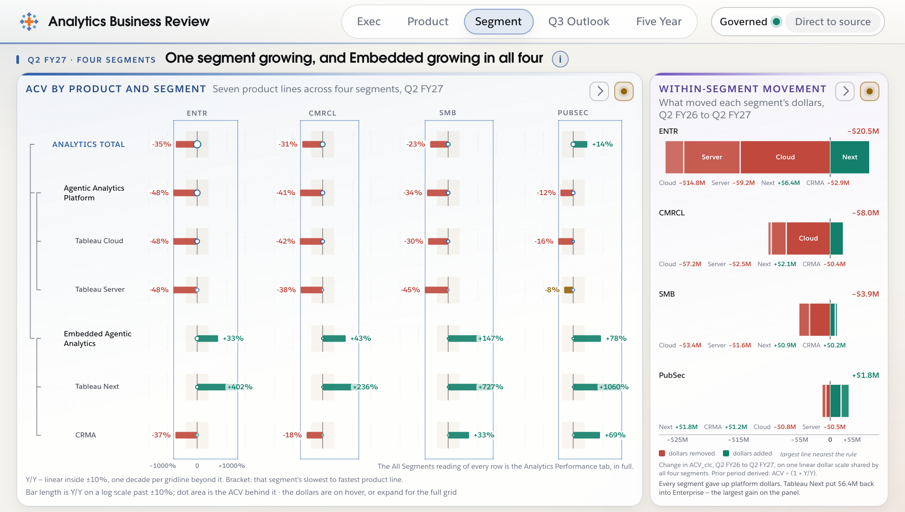
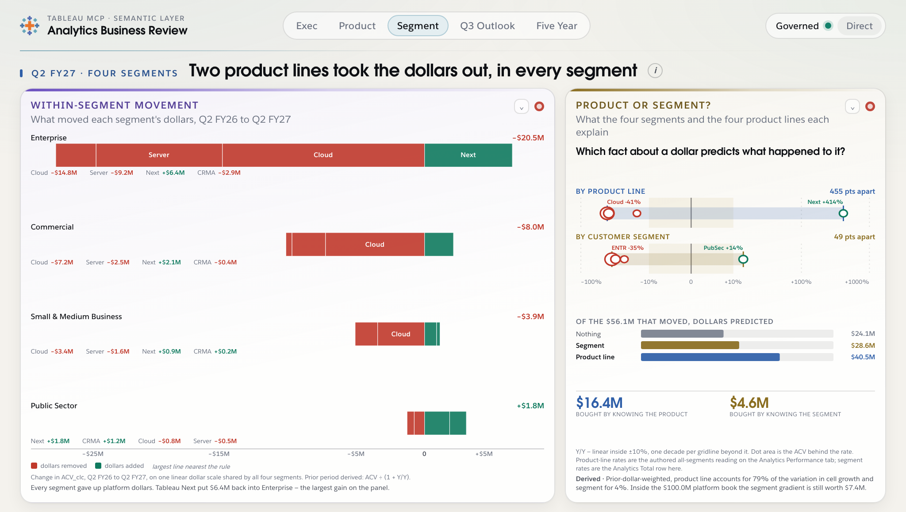
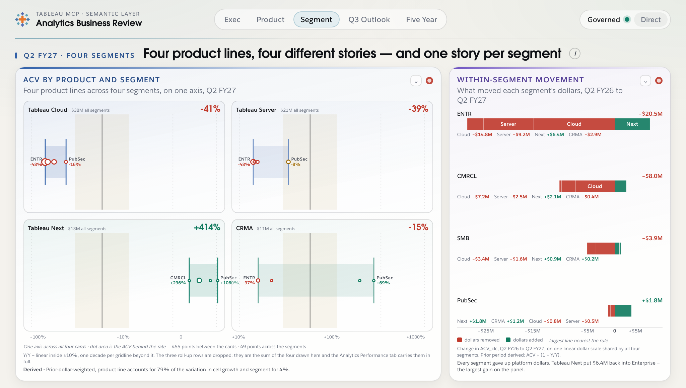
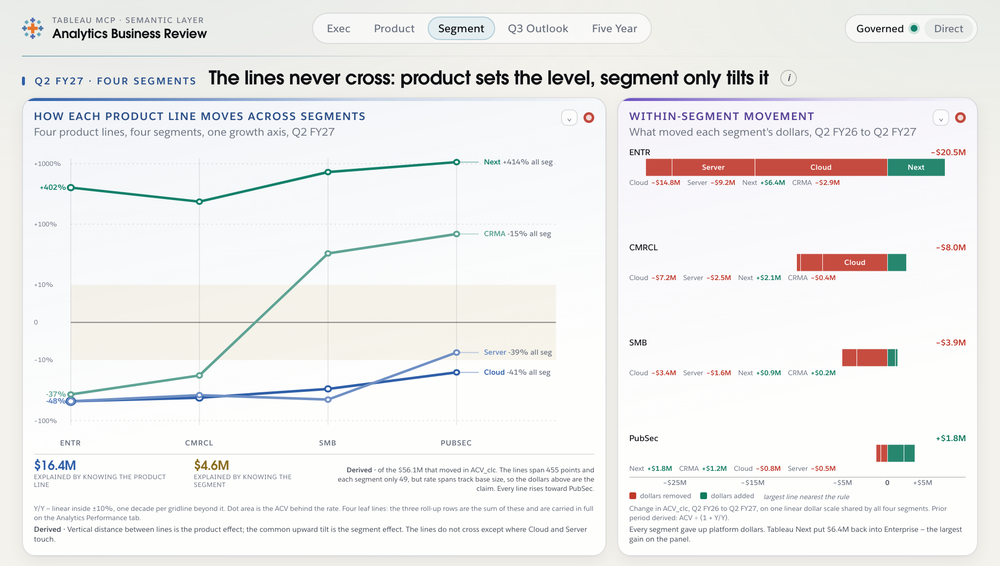
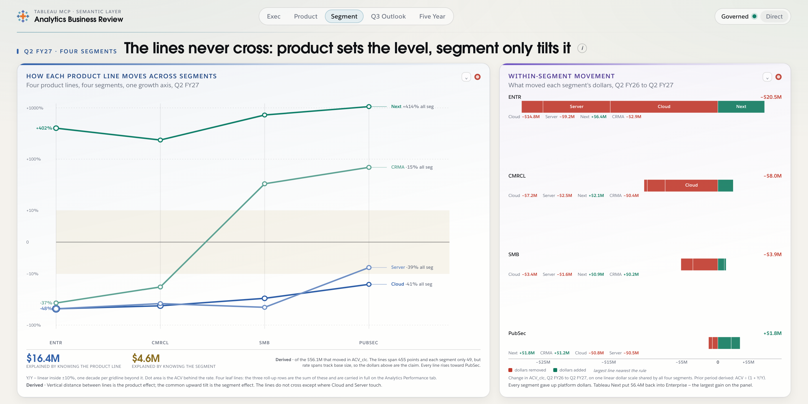

# Segment tab redesign — `performance-by-segment`

Design exploration for the two panels on the Segment tab: `seg-matrix` (seven
product lines × four segments, 28 cells) and `seg-spread` (dollar movement).

> **Status: built.** Alternative C shipped as `src/charts/segmentSlope.js`.
> The claim it argues changed between the spec and the build — see §8, which
> is the record of that change and supersedes the framing in §1 and §4.

**The feedback this answers, verbatim:**

> "It's hard to read at such a small size, because we have a lot of products and
> segments. Is there a better way to accomplish that visually tells the story
> that in the data it's not a segment issue, it's a product issue on why we are
> behind on ACV. Both charts are hard to read."

Mockups: `docs/mockups/segment/alt-{a,b,c}-*.html`, rendered into
`docs/mockups/segment/shots/`. They are standalone — they import
`./kit.js` and `./kit.css` only, never `../../../src/`, and nothing in `src/`
imports them. The board's real fonts are loaded from `fonts/` by relative path.

All authored figures in the kit are transcribed from `data/board.json` into
`kit.js`'s `AUTHORED` block. Everything computed from them is in `DERIVED`, is
labelled **Derived** wherever it renders, and is reproducible by
`docs/mockups/segment/verify-claim.py`.

---

## 1. Does the claim hold? Yes in dollars — but not for the reason the tab implies

The user's claim is a variance-decomposition claim: *which product a dollar sits
in predicts its fate; which segment it sits in barely does.* No panel on the tab
currently expresses it. Before designing around it, it was tested on the
certified additive dollar measure (`ACV_clc`), not only on rates —
`docs/spread-redesign.md` established that spreads of Y/Y rates mostly measure
base size, because a line growing off almost nothing dominates any rate-based
dispersion.

### 1.1 The dollar test

Predict every cell's movement from one fact about it, then total the absolute
dollar error. Sixteen leaf cells (four leaf product lines × four segments),
prior period derived as `ACV ÷ (1 + Y/Y)`.

| What you know about a dollar | Unexplained movement | Share of the $56.1M gross |
| --- | --- | --- |
| Nothing (everything at the overall −26.5%) | $32.1M | 57.1% |
| Only its **product line** | $15.7M | 27.9% |
| Only its **segment** | $27.5M | 49.0% |

Knowing the product line removes **$16.4M** of the $32.1M error. Knowing the
segment removes **$4.6M**. **Product is worth 3.6× what segment is worth, in
dollars.** The rate-based version of the same question is much louder — a
prior-dollar-weighted η² of 78.6% for product against 3.7% for segment, a ratio
of 21.3× — and that gap between 21.3× and 3.6× is exactly the base-size
contamination `spread-redesign.md` warned about. **The 3.6× is the honest
number and it is the one the mockups print.**

So the claim holds. The tab should say so.

### 1.2 The caveat that matters, and that no alternative should bury

The result is carried almost entirely by **Tableau Next**, a line with $2.77M of
prior dollars growing +405%. Drop it and the decomposition inverts:

| Book tested | Product removes | Segment removes | Verdict |
| --- | --- | --- | --- |
| All four leaf lines ($115.7M prior) | 51% | 14% | product, by 3.6× |
| Tableau Next dropped ($112.9M prior) | 5% | 54% | **segment** |
| Platform only — Cloud + Server ($100.0M prior) | 1% | 82% | **segment**, overwhelmingly |

Read plainly: **"it's a product issue" is true of the whole book, and it is true
because Embedded is growing while Platform is not.** Cloud (−40.8%) and Server
(−38.6%) behave almost identically, so *within* the platform book product
predicts nothing and the only thing that varies is segment — Enterprise platform
is −48% while PubSec platform is −12%. Inside the $100.0M platform book, where
the ACV shortfall actually sits, **the segment gradient is still worth $7.4M.**

That is not a contradiction of the claim, it is its mechanism: the split that
matters is Platform versus Embedded, and no segment rescues a platform dollar.
But a design that shows only "product wins, segment loses" would be overclaiming.
The recommended alternative shows the segment tilt rather than suppressing it,
which is why it was recommended.

### 1.3 What the figures are

Authored, from `seg-matrix.metrics.rows` and `seg-spread.metrics.rows`. Prior
period is derived; the board already derives it the same way and labels it so on
`seg-spread`.

| | ENTR | CMRCL | SMB | PubSec | All segments (authored) |
| --- | --- | --- | --- | --- | --- |
| Tableau Cloud | −48% | −42% | −30% | −16% | −41% |
| Tableau Server | −48% | −38% | −45% | −8% | −39% |
| Tableau Next | +402% | +236% | +727% | +1060% | +414% |
| CRMA | −37% | −18% | +33% | +69% | −15% |

Within a product line the four segments span 32–105 points (Next excepted).
Within a segment the four product lines span 279–1092 points. The all-segments
column is authored on `perf-hierarchy`; it differs slightly from the
prior-dollar-weighted marginal recomputed from this grid (e.g. authored −41% for
Cloud against a derived −40.8%). That is one of the known inconsistencies. Per
the standing decision it renders faithfully and silently: **the panels display
the authored figure and never the recomputed one**, and derived quantities are
confined to the explicitly labelled Derived line.

---

## 2. Why the current matrix fails at 1024×580



Not styling. Structure:

1. **28 cells on 28 axes.** Each cell carries its own miniature growth axis
   about 55px wide. Comparing Cloud's ENTR reading to Cloud's PubSec reading
   means comparing two separate rulers a column apart.
2. **The comparison that is the argument is left to the reader.** "Rows are
   tight, columns are scattered" is a statement about the *variance* of the
   grid, and a grid asks you to compute it mentally across 28 positions.
3. **Three of the seven rows are sums of the other four.** Analytics Total,
   Agentic Analytics Platform and Embedded Agentic Analytics are roll-ups of
   Cloud + Server + Next + CRMA. They cost 12 of the 28 cells and carry no
   information the leaves do not, and `metrics.allSegmentsNote` already says the
   full hierarchy lives on the Analytics Performance tab.
4. **`seg-spread` is fine and is not the problem.** It is legible at this size;
   it is only cramped by the matrix taking the full-width band above it.

Dropping the three roll-up rows takes the grid from 28 cells to 16 without
losing a figure, and `metrics.interval.leafLevel: 2` already marks which rows
are leaves, so the drop is data-driven rather than hardcoded.

---

## 3. Three alternatives

All three are shot at 1024×580, the hard case. The recommendation is also shot
at 1440×720. Each shows the whole tab so both panels are judged together.

### Alternative A — "Product or segment?" as an explicit verdict panel

**Thesis:** *In three seconds a reader sees two rows of dots — one scattered
across 455 points, one clustered inside 49 — and reads off $16.4M against
$4.6M.*

The movement panel becomes the hero at full width. Beside it a new panel puts
the two spreads literally side by side as two lanes on one shared growth axis,
then converts the comparison into dollars: three bars of explained movement
(nothing / segment / product line) against the same $56.1M total, and the
verdict pair beneath.



**For:** it answers the question asked, in the measure the board trusts, and the
two-lane comparison needs no caption. **Against:** the argument lives in the
side panel while the hero is the movement chart, so the tab has two subjects.
The per-cell detail is gone entirely — this alternative shows marginals only,
and a reader who wants Cloud-in-PubSec must expand.

### Alternative B — small multiples, one card per product line

**Thesis:** *Four cards on one shared axis; each card's cluster is short and the
four clusters sit in completely different places.*

Four leaf product lines, one card each, four segment dots per card, all sixteen
dots on a single axis that spans all four cards. The change from the matrix is
the shared ruler: today each of the 28 cells has its own.



**For:** keeps every leaf figure visible, and the cluster band per card makes
within-product agreement a directly measurable length. **Against:** the reader
still performs the key comparison across cards rather than seeing it. Only the
two extreme segments can be labelled in place at this width — four labels
collide precisely on the rows where the segments agree, which is the interesting
case — so half the figures move to hover anyway.

### Alternative C — the slope graph *(recommended)*

**Thesis:** *Four lines that never cross: how far apart they sit is the product
effect, and the gentle common upward tilt to PubSec is the entire segment
effect.*

One axis, four segments across the bottom, one line per leaf product line, 16
dots. Vertical distance between lines is the product effect. The slope of each
line is the segment effect. Both spreads are in one image, and the fact that
the lines never cross — except where Cloud and Server touch, which is itself the
finding from §1.2 — *is* the claim.



**For:** the argument is in the hero, needs no caption, and survives the size
reduction. It is the only one of the three that shows the §1.2 caveat instead of
hiding it — every line visibly rises toward PubSec, so a reader sees the segment
effect is real and small rather than being told it is nil. **Against:** the log
growth axis makes CRMA's slope look dramatic; it spans 106 points against
Cloud's 32.

Its verdict pair was deliberately changed from the point spans to dollars. The
picture is a rate picture and its 455-point vertical span is mostly Tableau
Next's small base talking. The point spans stay in the note, where they describe
the picture rather than carry the claim.

---

## 4. Recommendation — Alternative C

**Sixteen marks in four lines on one axis, against the current 28 cells on 28
axes.** Twelve cells are dropped: the three roll-up rows, which are sums of the
four leaves and are carried in full on the Analytics Performance tab. No figure
is lost from the board; every dropped figure remains one tab away, on hover, and
in the expand, as `metrics.allSegmentsNote` already promises.

Reasons, in order:

1. **The argument is the hero.** The tab's job is to answer one question, and C
   answers it with the shape of the chart rather than with a caption.
2. **It carries the certified measure.** $16.4M against $4.6M, on `ACV_clc`, not
   a spread of rates.
3. **It is honest about §1.2.** The common upward tilt to PubSec is visible.
   A and B both flatten the tab to "product wins", which overclaims against the
   platform book.
4. **It leaves `seg-spread` intact.** The movement panel is not the problem and
   is not touched — it moves to the right column at its existing narrow width,
   which is a width it already renders at today.
5. **It is the cheapest of the three.** A needs a whole new panel type; C needs
   one renderer and no change to the other panel.

At 1440×720 it gains vertical room in the plot rather than new content:



---

## 5. `metricMatrix.js` — the premise is inverted, and the answer is neither

**The Segment tab does not call `metricMatrix.js` and never has.** Checked
against `data/board.json`, the three matrix portlets on the board are:

| Tab | Portlet | Kind |
| --- | --- | --- |
| `analytics-performance` | `perf-hierarchy` | `growthMatrix` |
| `performance-by-segment` | **`seg-matrix`** | **`growthMatrix`** |
| `q3-outlook` | `outlook-matrix` | `metricMatrix` |

`metricMatrix.js` (890 lines) has exactly one caller on the whole board,
`q3-outlook/outlook-matrix`. `docs/q3-growth-redesign.md` §8 states this
correctly and flags it as "the single largest fact in this estimate and it
should be checked before it is relied on" — **it checks out.** The Q3 redesign
can delete `metricMatrix.js` on G3 without consulting this document; nothing
proposed here keeps it alive.

The module actually at issue is **`growthMatrix.js` (1038 lines), which has two
callers** — `perf-hierarchy` and `seg-matrix`. So:

> **Verdict: `metricMatrix.js` — no opinion, not a caller, delete it freely.
> `growthMatrix.js` — fork, do not retire.** `perf-hierarchy` on the Analytics
> Performance tab still needs the full seven-row matrix and is not in this
> redesign's scope. `growthMatrix.js` is left untouched and the Segment tab
> stops calling it.

---

## 6. Implementation estimate

### New — `src/charts/segmentSlope.js`, ~280 lines

One renderer, registered in `src/charts/index.js` (+2 lines). It reuses
`growth.js`'s `growthFraction` axis unchanged — that module is already shared by
both matrix renderers and is explicitly documented as not living in `svg.js` for
this reason — plus `svg.js` helpers and `anim.js`. Breakdown: axis and gridlines
~60, the four polylines and 16 dots ~70, in-place labelling and collision
avoidance ~60, the verdict strip ~40, Direct-mode branch ~50.

### Unchanged

`growthMatrix.js`, `groupMovement.js` (504 lines, renders `seg-spread`),
`rulesCard.js` (renders `seg-rules`, which is the (i) flyover content and is not
a visible portlet), `metricMatrix.js`, `anim.js`, `styles/fonts.css`.

### `data/board.json` — owned by another agent, coordinate before touching

Three edits, none of which invent a figure:

1. `seg-matrix.kind`: `growthMatrix` → `segmentSlope`.
2. **One authored addition.** The line-end labels read "Next +414% all seg".
   Those all-segments rates are authored today on `perf-hierarchy`, not on
   `seg-matrix`, so they must be copied onto `seg-matrix.metrics.rows` as an
   `allSegmentsYoy` field. This is a copy of an authored figure, not a
   derivation. If that copy is unwelcome, drop the labels — the chart works
   without them.
3. **`directMode.effect` needs re-authoring.** The current string opens "All
   thirty-five cells still render", which stops being true. It is authored prose
   and must be rewritten by whoever owns the copy, not by the renderer. Flagged,
   not drafted.

`metrics.interval.leafLevel: 2` already identifies the four leaf rows, so
dropping the roll-ups needs no new field.

### `styles/` — owned by another agent

Band `seg-main` and `seg-side` become two columns at roughly 1.62fr / 1fr rather
than the current ratio. CSS-only, no new band.

### Contract compatibility

- **Two-stage choreography and the veil contract.** A better fit than the
  matrix, not a worse one. Stage one veils and draws the axis, gridlines and
  segment ticks; stage two draws the four polylines with `anim.js`'s existing
  `strokeDraw` and pops the dots with `stagger`. `veil()` leaves already-hidden
  nodes invisible, so veiling four lines cannot cost content the way veiling 28
  cells risks. Four staged units instead of 28.
- **Per-portlet provenance flip.** Untouched — the flip is a property of the
  card face, not its contents.
- **The (i) rules flyover.** Untouched. `seg-rules` still mounts through
  `rulesCard.js`.
- **Three-tier Direct-mode rendering.** `seg-matrix.directMode` is authored at
  `tier: "red"`, `provenance: "supplemented"`, grounded in the derived segment
  dimension. The tier and grounding are unchanged; only the `effect` copy needs
  the rewrite noted above.
- **Brand faces.** Avant Garde For Salesforce Demi for the display numerals and
  headline, Salesforce Sans for body, at the `styles/fonts.css` line-height
  floors. The mockups load the real faces from `fonts/`.
- **Layout floor.** `docs/redesign.md` gives ~470px of band height at 1024×580,
  after 58px of topbar, 27px of status, 21px of panel head and 18px of gap. Both panels compose inside it and nothing scrolls; the 1024×580
  shots are the proof.

### Provenance note worth surfacing in the (i)

The segment dimension is **derived, and native to neither model** — PubSec is an
Operating Unit rather than a segment peer, and the four columns come from
`IF OU = Public Sector then OU else segment end`, the model owner's own
expression (`docs/semantic-layer.md` §10.2). A tab whose entire argument is
"segment does not explain much" is a good place for a reader to learn that the
segment dimension is a one-line derivation somebody has to write down once.
That is already the authored `directMode.thesis` for this portlet; the redesign
gives it a more pointed home.

---

## 7. Reproducing

```
python3 -m http.server 8791 --bind 127.0.0.1        # from the repo root
bash docs/mockups/segment/shoot.sh                  # all three at 1024x580
bash docs/mockups/segment/shoot.sh alt-c-slope 1440 720
python3 docs/mockups/segment/verify-claim.py        # §1, all of it
```

The mockups are ES modules and need an origin; `file://` fails CORS and renders
an empty page.

---

## 8. What was built, and the claim that changed on the way

The recommendation in §4 was accepted. One thing about it was not: the tab was
asked to argue **"motion sets the level, segment only tilts it"** rather than
"product sets the level", on the strength of the §1.2 caveat — that the product
result rides on Tableau Next, and that inside the platform book product predicts
nothing while segment is worth $7.4M.

That reframe was measured before it was built, on `ACV_clc`, by the same
counterfactual §1.1 used. `docs/mockups/segment/verify-motion.py` reproduces it.

### 8.1 Motion does not survive the dollar test

| What you know about a dollar | Unexplained | Removes | η² |
| --- | --- | --- | --- |
| Nothing | $32.06M | — | — |
| **Motion** (Platform / Embedded) | $28.51M | **$3.55M — 11%** | 19.6% |
| Segment (4) | $27.50M | $4.56M — 14% | 3.7% |
| Product line (4) | $15.67M | $16.39M — 51% | 78.6% |

**Motion is the weakest of the three.** It explains $3.55M against product's
$16.39M — a fifth — and it is beaten by segment, the grain the tab exists to
dismiss. Printing the product-grain $16.4M under a motion headline would have
been the overclaim in reverse, so the panel prints no motion numeral at all.

### 8.2 Why it fails is the half of the reframe that survives

The two motions are not comparable objects:

| Motion | Prior | Rate | Members | Internal span |
| --- | --- | --- | --- | --- |
| Platform | $100.04M | −40.0% | Cloud −41%, Server −39% | **2 pts** |
| Embedded | $15.68M | +59.4% | Next +414%, CRMA −15% | **429 pts** |

Platform is a real motion: $100M moving as one block, its two lines two points
apart. Embedded is a bucket containing a rocket and a decliner, and averaging
them destroys the signal that made product grain strong. A three-way split of
Platform / Next / CRMA recovers $16.28M — essentially all of product's power —
which locates the loss precisely: merging Cloud into Server costs $0.11M,
merging Next into CRMA costs $12.7M.

So the tab argues **the block, not the two-motion split**, and the verdict is
stated in movement rather than in explained variance:

- **−$40.0M** given up by Platform, in all four segments
- **+$11.2M** added by Tableau Next, in all four segments

Both are exact sums over `seg-spread`'s twenty authored dollar movements, and
`scripts/author-segment-slope.mjs` re-derives and asserts them on every run so a
later edit to those movements cannot leave the verdict stale.

### 8.3 The headline

"The lines never cross" was dropped. It was contradicted by the spec's own
caption, which conceded Cloud and Server touch. Under this framing the touching
is the evidence, so the headline is:

> **Platform fell as one block — the segment only tilts it**

The tilt stays visible and stays quantified: every line rises toward PubSec, and
the governed verdict note closes on the $8.4M that tilt is worth inside the
block.

### 8.4 The two metadata items

**All Segments line-end labels.** Copied onto each `seg-matrix` row from
`perf-hierarchy`, where they are authored, carrying a `source` field naming that
portlet. They are never recomputed from these four columns — the authored
marginal and the recomputed one differ slightly, and recomputing would silently
reconcile a disagreement this board renders faithfully. They are not plotted at
a y-position, which would put a coarser-grain reading on the same axis as the
four columns and imply it was one of them. They appear in the motion strip as
each line's All Segments rate, in every tooltip labelled as that tab's reading,
and as a column in the expand. The motion spans in §8.2 are derived from them.

`perf-hierarchy`'s Direct-mode block overrides dollars only and records
`rates unchanged`, so these rates are identical in both modes and the strip
needs no Direct-mode variant.

**`directMode.effect`.** Rewritten off "All thirty-five cells still render".
It now opens on the sixteen marks and the two motion groups, keeps the original
silent-detectability claim, and adds what the new form makes visible: the All
Segments reading never touches the derived segment dimension, so it is the one
figure the hazard cannot move — which is why the platform block still reads as a
block while the four columns underneath it are quietly reallocated. The
segment dimension being derived rather than native to either model
(`docs/semantic-layer.md` §10.2) is the grounding, unchanged at `tier: red`,
`provenance: supplemented`.

The governed verdict note closes on the segment tilt inside the block, and that
is the one figure this hazard does move. Direct mode withdraws that sentence
rather than restating it.

### 8.5 Verification

Nine states clean — 1440×720, 1280×620 and 1024×580, each governed, Direct and
audited: no scrollers, no stage overflow, nothing clipped, console clean. The
four other tabs are unchanged at 1024×580. A settle probe reports 16 dots, 4
lines, 16 hit targets all `tabIndex=0` and `aria-label`led, nothing left
non-opaque, and all 7 rows in the expand with the 3 roll-ups marked. Every
animated node is in the veil list and the renderer contains no `style.opacity`,
no `transition` and no timer of its own — all motion goes through `anim.js`,
which is what carries `prefers-reduced-motion` jump-to-final.

### 8.6 Marks

**16 marks in 4 lines on one axis, against 28 cells on 28 miniature axes.** The
three roll-up rows are dropped from the plot as sums already carried in full on
the Product tab, and stay in `metrics.rows` so the expand table and the
index-keyed Direct-mode overrides keep working untouched.

### 8.7 `metricMatrix.js`

The finding in §5 held and was acted on by the Q3 agent: the module had exactly
one caller, `q3-outlook/outlook-matrix`, which now mounts `growthLanes`, and
`src/charts/metricMatrix.js` is deleted. Nothing in this work referenced it.

`growthMatrix.js` was **forked, not retired**, exactly as §5 called it.
`perf-hierarchy` is still a caller and still needs the seven-row form, so it is
untouched; `seg-matrix` simply stopped calling it.
