# Redesign: the within-group spread panel

Status: design exploration. Three alternatives, rendered, with a recommendation.

Scope: `seg-spread` ("Within-segment spread", Segment tab, five rows in a side
column) and `perf-divergence` ("Within-motion spread", Product tab, two rows in
a wide strip beneath the matrix). Both are `kind: "growthSpread"` and both are
drawn by `src/charts/growthSpread.js`. They are treated as one problem
throughout, and §7 says where the answer has to diverge and why.

Mockups: [`docs/mockups/spread/`](./mockups/spread/) — six standalone pages,
twelve screenshots at 1024x580 and 1440x720. They import nothing from `src/`
and nothing in `src/` imports them.

---

## 1. The three criticisms, ruled on

### 1.1 "The headline metric is close to meaningless" — upheld, and it is worse than stated

The reading is right and the mechanism is right. Two additional facts sharpen it.

**The five-row comparison is a one-line comparison in disguise.** Every row
takes its fast end from Tableau Next, so the spread is Tableau Next's Y/Y plus
the absolute value of the slow end — and the slow end contributes between
**1.5% and 15.1%** of the total (PubSec 16 of 1076; CMRCL 42 of 278). Ranking
the segments by spread therefore produces **exactly** the ranking by Tableau
Next's own Y/Y, in the same order, with no exceptions:

| | PubSec | SMB | All Segments | ENTR | CMRCL |
| --- | --- | --- | --- | --- | --- |
| spread, points | 1076 | 772 | 455 | 450 | 278 |
| Tableau Next Y/Y | +1060% | +727% | +414% | +402% | +236% |

The panel occupies five rows of a scarce slot to rank four segments and a total
by one product line's growth rate — a rate governed by how small that line was
a year ago ($0.12M in SMB, $0.17M in PubSec) — and prints the result as a fact
about the segment.

**It is not merely uninformative on the Product tab, it is degenerate.** The
Platform row's two lines are −41% and −39%. The panel draws that as a
"2 points apart" stub and gives it half the strip. The renderer's own comment
calls this out as the intended contrast — one motion moves together, the other
does not — and that contrast is real, but the form spends an equal share of a
scarce slot on a mark with no extent. In dollars the same two lines are
−$26.4M and −$13.4M. **Cloud removes twice what Server does, and the current
encoding is the one encoding that cannot show it.**

### 1.2 "It restates what the matrix already shows" — upheld, and the overlap is larger than two cells per row

It is worse than a min and a max. `seg-matrix.caption` reads:

> Bar length is Y/Y on a log scale past ±10%; **dot area is the ACV behind it**

The matrix already carries a dollar channel on every one of its 28 cells, as
`Math.sqrt(value / stakeMax)` on the stake circle (`growthMatrix.js:587`). So
the matrix is already a rate-against-size chart. That matters directly for the
direction proposed in the brief — see §3.3 — and it means the spread panel's
overlap with its neighbour is not two cells but the whole grammar: same axis,
same measure, same marks, coarser grain.

### 1.3 "Aesthetically it is weak, and the band and triangle are unexplained" — upheld, with a specific cause worth fixing regardless of which alternative is chosen

Both marks *are* documented. Neither documentation reaches the reader.

- **The triangle** is the group's own Y/Y (`growthSpread.js:244–264`). It is
  named in `seg-spread.metrics.caption` — "the caret is the segment's own
  rate" — and **`perf-divergence.metrics.caption` does not name it at all**
  ("One motion moves together; the other does not"). So on the Product tab the
  caret is genuinely unexplained on the page.
- **The shaded band** is the ±10% linear core of the symlog axis
  (`CORE_FRACTION`, `growth.js:23`). Its meaning is stated in
  `seg-matrix.axisNote` — "linear inside ±10%, one decade per gridline beyond
  it" — which belongs to *the other portlet*. The spread panel's own axisNote
  says only "Same growth axis as the matrix beside it". A reader who has not
  read the neighbour's footnote has no way to decode the band.

On the Segment tab there is a third factor: in the current layout the panel's
whole `.spread-foot` sits below the fold, so even the caption that does explain
the caret is not visible. This is a composition failure, not a copy failure.

The type criticism is also upheld: `.spread-lines` resolves to
`clamp(8px, 0.55vw, 9.5px)`, so at 1024 the two product-line names — the
strings that say *what* the interval is between — render at 8px, below every
other label on the tab.

### 1.4 What the brief missed

**The panel's own semantic block already argues against the panel.**
`seg-spread.semantic.why` says the rates "are non-additive and come from the
layer, never from dividing two fetched totals", and `semantic-layer.md`
line 181 records the model owner's rule: *"`SUM` applied to a ratio —
nonsense, no error. Coverage, funded %, velocity, Y/Y, CAGR and averages are
**non-additive**."* The panel then takes the arithmetic difference of two
non-additive rates and prints it as its largest numeral. Subtracting two Y/Y
figures is not the same error as summing them, but it is the same family, and
it is being committed by the one portlet whose stated job is to demonstrate
that the layer knows how a measure aggregates.

**The Product tab's motion grouping cannot be sourced live at all.**
`semantic-layer.md:337` records that the Embedded/Agentic split has **no
governed dimension in either model** — "No product-motion dimension exists."
`perf-divergence.semantic.sdm` nonetheless names
`Sls_Forecasting_Metrics_Expanded`. This is pre-existing and applies to any
grouped design in that slot, including all three below; it is not a reason to
prefer one alternative over another, but §6 flags it because the brief asked
for anything that can never be fed live.

---

## 2. Are per-cell dollars actually authored for all 28 cells?

**On the Segment tab, yes. On the Product tab the question does not apply, and
the honest answer is that there are only seven dollars, not twenty-eight.**

### 2.1 `seg-matrix` — 28 of 28

Every row carries a `values` array of four integers alongside `yoy`. Verified
programmatically: 7 rows x 4 segments = 28 cells, no nulls, no missing entries.

| $M | ENTR | CMRCL | SMB | PubSec |
| --- | --- | --- | --- | --- |
| Analytics Total | 39 @ −35% | 18 @ −31% | 12 @ −23% | 15 @ +14% |
| Agentic Analytics Platform | 26 @ −48% | 13 @ −41% | 10 @ −34% | 10 @ −12% |
| Tableau Cloud | 16 @ −48% | 10 @ −42% | 8 @ −30% | 4 @ −16% |
| Tableau Server | 10 @ −48% | 4 @ −38% | 2 @ −45% | 6 @ −8% |
| Embedded Agentic Analytics | 13 @ +33% | 4 @ +43% | 2 @ +147% | 5 @ +78% |
| Tableau Next | 8 @ +402% | 3 @ +236% | 1 @ +727% | 2 @ +1060% |
| CRMA | 5 @ −37% | 2 @ −18% | 1 @ +33% | 3 @ +69% |

### 2.2 `perf-hierarchy` — seven, and one column

The Product matrix has **one** segment (`{ id: "all", reference: true }`) and
each row carries a scalar `value`, not an array. There are seven authored
dollars: 83, 59, 38, 21, 24, 13, 11. This is the all-segments read, and it is
the correct scope for that tab; but the brief's "28 cells" only exists on the
Segment tab, and any Product-tab design has seven figures to work with.

### 2.3 Prior year is exactly derivable, and the residuals are small but not zero

`prior = current / (1 + Y/Y)`. Both inputs are authored per cell, so this is
exact arithmetic over authored values — but the authored dollars are whole
$M, so the recovered priors carry the rounding of their inputs.

**Product tab (from `perf-hierarchy`):**

| line | current | prior (derived) | movement (derived) |
| --- | --- | --- | --- |
| Tableau Cloud | $38M | $64.41M | **−$26.41M** |
| Tableau Server | $21M | $34.43M | **−$13.43M** |
| Tableau Next | $13M | $2.53M | **+$10.47M** |
| CRMA | $11M | $12.94M | **−$1.94M** |
| Agentic Analytics Platform | $59M | $98.33M | −$39.33M |
| Embedded Agentic Analytics | $24M | $15.29M | +$8.71M |
| Analytics Total | $83M | $113.70M | −$30.70M |

**Segment tab (from `seg-matrix`), leaf lines only:**

| $M movement | ENTR | CMRCL | SMB | PubSec |
| --- | --- | --- | --- | --- |
| Tableau Cloud | −14.77 | −7.24 | −3.43 | −0.76 |
| Tableau Server | −9.23 | −2.45 | −1.64 | −0.52 |
| Tableau Next | +6.41 | +2.11 | +0.88 | +1.83 |
| CRMA | −2.94 | −0.44 | +0.25 | +1.22 |
| **sum of the four** | **−20.53** | **−8.02** | **−3.94** | **+1.77** |

### 2.4 Three reconciliation facts that constrain what can be drawn

The brief predicted a dollar decomposition might surface an inconsistency. It
surfaces three. Per the standing rule, they are recorded here and **routed
around in the design rather than annotated on the page**.

1. **CMRCL's authored dollars do not close, at any level.** Total 18 against
   Platform 13 + Embedded 4 = 17; Platform 13 against Cloud 10 + Server 4 = 14;
   Embedded 4 against Next 3 + CRMA 2 = 5. ENTR, SMB and PubSec close exactly.
   *Route-around: no proposal draws a closing bridge against an authored group
   total.* §4.1 explains why the recommended form is a contribution chart and
   not a bridge — the distinction is precisely this.

2. **Derived leaf movements do not sum to the derived total movement.** The
   residuals are −0.47, −0.06, +0.35 and +0.07 $M per segment, and +0.60M at
   L2 on the Product tab against +0.08M at L1. These are rounding in the
   authored whole-$M inputs, and they are small — but a bridge would have to
   draw them as a residual bar, and there is no authored figure to label it.
   *Route-around: as above.*

3. **The Segment tab and the Product tab disagree by $1M on three rows.**
   Summing `seg-matrix` across segments gives Analytics Total 84 against
   `perf-hierarchy`'s 83; Tableau Server 22 against 21; Tableau Next 14 against
   13. *Route-around: no Segment-tab proposal sums across segment columns.*
   This is why the "All Segments" row is dropped from the Segment-tab
   alternatives (§4.1) — that row is the only place the current panel implies a
   cross-segment total, and the Product tab is the authored all-segments view.

### 2.5 The house rule: derive to design, author to ship

`docs/visualization-research.md`, "Prerequisite — author the prior period, do
not derive it", is directly on point and is binding:

> a renderer back-solving a prior year from a rounded percentage would be the
> app doing the exact thing it criticises

The mockups compute the priors so the forms can be judged. **A shipped version
must read authored figures.** §6.2 states exactly what has to be added to
`board.json`.

---

## 3. The proposed direction, evaluated

### 3.1 Recasting dispersion in dollars — supported, on both of the brief's grounds and one more

The commensurability argument holds. The additivity argument holds and is
stronger than stated: `ACV_clc` is the board's certified additive measure and
the layer's own documentation singles out Y/Y as non-additive, so moving this
panel to dollars moves it from the one thing the layer says you must not do to
the one thing it guarantees. For a board whose thesis is that the semantic
layer's contribution is knowing how a measure aggregates, that is the right
side of the argument to be on.

One correction to the brief's framing. It expects the dollar view to make
Tableau Next "visibly tiny", matching the Product tab's headline. It does not,
and should not: Tableau Next's movement is **+$10.47M** — the largest positive
movement on the board and the third largest of any sign among the four product
lines, behind Cloud's −$26.4M and Server's −$13.4M. "Growing off almost
nothing" is true of its *base* ($2.53M) and false of its *contribution*. The
dollar view does not restate the headline; it completes it, and the completed
sentence is the better one: a $10.5M gain against a $39.8M loss.

### 3.2 A bridge is not available; a contribution chart is

See §2.4. The closure a bridge asserts is exactly the property this data does
not have. A contribution chart draws the same per-line arithmetic and makes no
closure claim, so it renders honestly without surfacing anything.

### 3.3 "A rate axis with dollar-weighted marks" — rejected, because the matrix already is one

This was the brief's second suggestion and it is the one to drop. The matrix's
stake circle is already area-scaled to ACV on all 28 cells. Building a
rate-against-size chart in the panel beside it would make criticism 1.2 worse,
not better — it would be the same two channels at a coarser grain, one card
away.

Worth recording as a defect for whoever owns the matrix: on the Segment tab
that channel is compressed. `stakeMax` is 83 — the all-segments total — while
the largest segment cell is 39, so no cell uses more than 69% of the radius
scale; and `RMAX * sqrt(value / 83)` falls below the 1.6 floor at $2.74M, so
**6 of the 28 cells draw at the same minimum radius** and are not distinguished
from each other at all. The channel does real work on the Product tab and much
less on the Segment tab.

### 3.4 "Should the panel exist at all" — a real option, and it is Alternative C

---

## 4. Three alternatives

All three keep: one viewport at ~580px content height, no scrolling, no build
step, no dependencies, hand-built SVG, the two-stage choreography and the
`veil()` contract, the per-portlet provenance flip, the Governed/Direct
degraded rendering, the (i) flyover, and the brand faces with the
`styles/fonts.css` line-height floors. Neither the Knowledge Graph overlay nor
the footer status bar is designed around.

### 4.1 Alternative A — Within-segment / within-motion movement

> **In three seconds:** which product lines took dollars out and which put
> them in, how much each one moved, and whether the group's gains covered its
> losses.

One track per group. Losses stack leftward from a zero rule, gains stack
rightward, both in $M on one axis shared by every group in the panel. The
two wing lengths are the decomposition; their imbalance is the net, printed
once at the right of the group's name.

Design decisions worth stating:

- **Colour is sign, not product line.** The board's convention is that a
  number is coloured by whether it is good, and every other chart follows it.
  Encoding product line as hue would put a green mark on the loss side (CRMA
  in ENTR, CMRCL and the Product tab) and contradict the whole board. Line
  identity is carried by a fixed stack order — largest nearest the rule — and
  by inline labels wherever a piece is wide enough for one, with the rest on
  hover and in the expand table.
- **Not a bridge.** §2.4.1. No closing bar, no residual, no total drawn from
  parts. The group's authored net is printed as a numeral because it is
  authored; it is never drawn as the resultant of the stack.
- **Four rows, not five.** "All Segments" is dropped, because summing the
  segment columns produces 84 against the Product tab's authored 83
  (§2.4.3). The all-segments read is the Product tab.
- **The plot stretches.** `preserveAspectRatio="none"` with the zero rule held
  by `vector-effect`, so one grammar fills both a 460px side column and a
  ~45px strip. Every mark in a stacked bar is an axis-aligned rectangle whose
  meaning is its width, so there is no aspect ratio to preserve — this is the
  one place the dumbbell's two-plot-box compromise (`PLOT_WIDE` / `PLOT_SHORT`)
  can be deleted rather than ported.
- **The panel draws its own axis.** The current panel's note names an axis it
  never draws. This one prints $M ticks under the last row.

What the reader gets that the matrix does not have: movement. The matrix
carries level and rate on every cell and movement on none.

**Segment · 1024x580**
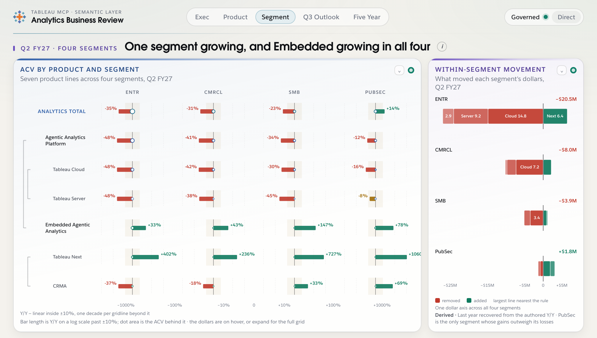

**Segment · 1440x720**
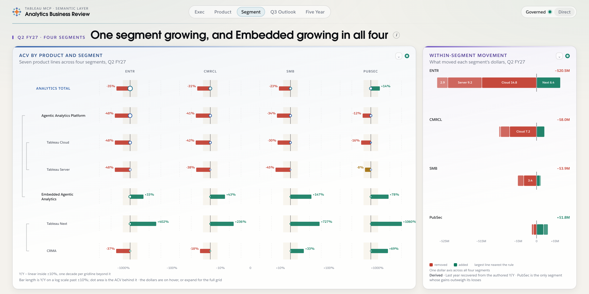

**Product · 1024x580**
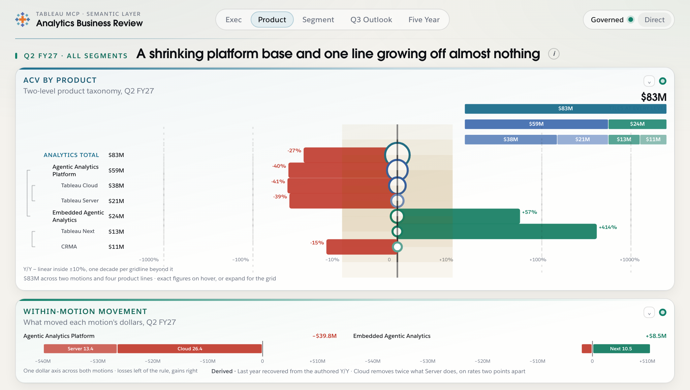

**Product · 1440x720**
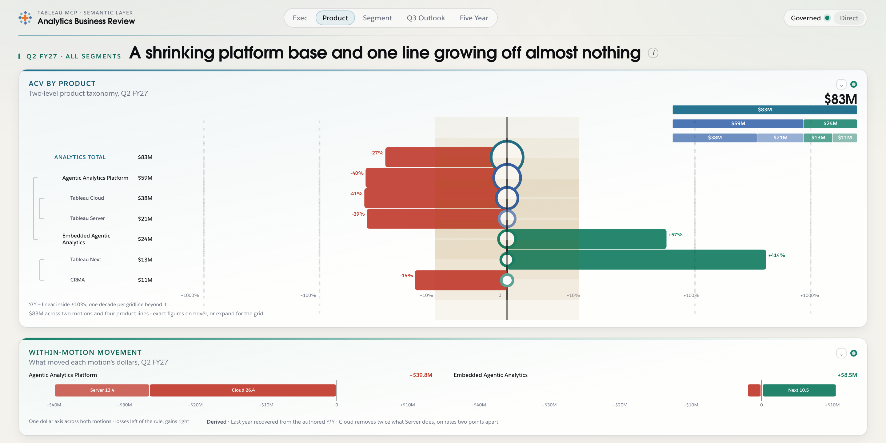

### 4.2 Alternative B — Within-segment / within-motion levels

> **In three seconds:** how big each product line was a year ago and how big it
> is now, on one dollar axis — so "growing off almost nothing" is a mark that
> starts on the origin rather than a sentence in a caption.

Per line, a hollow dot at last year's dollars, a filled dot at this year's, a
band between them, on one dollar axis shared across the panel. Groups keep
their headings so the taxonomy survives.

This is the form that shows the *base* rather than the *movement*, and it
makes the single most-quoted fact on the Product tab literal: Tableau Next's
mark begins at $2.5M and Cloud's begins at $64.4M, on the same ruler.

Its cost is row count. The Segment placement needs sixteen rows — four lines
in each of four segments — where the current panel has five, and the shared
axis is set by ENTR's $30.8M so PubSec's four marks occupy the leftmost fifth
of the track. That is honest (PubSec is small) and hard to read.

**Segment · 1024x580**
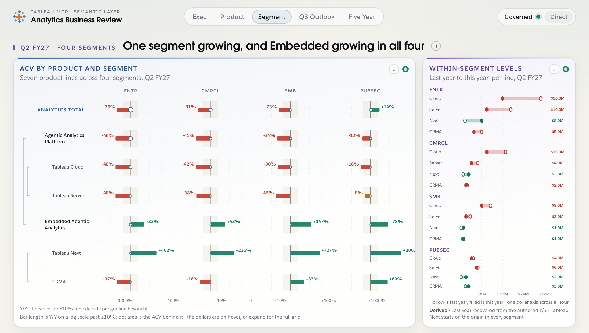

**Segment · 1440x720**
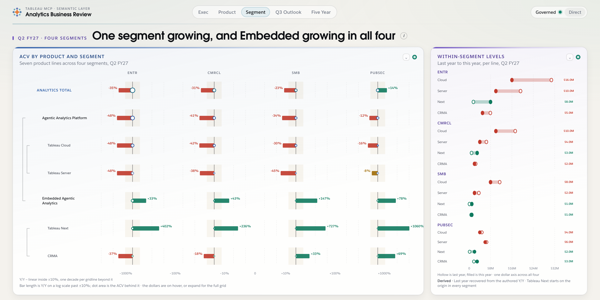

**Product · 1024x580**
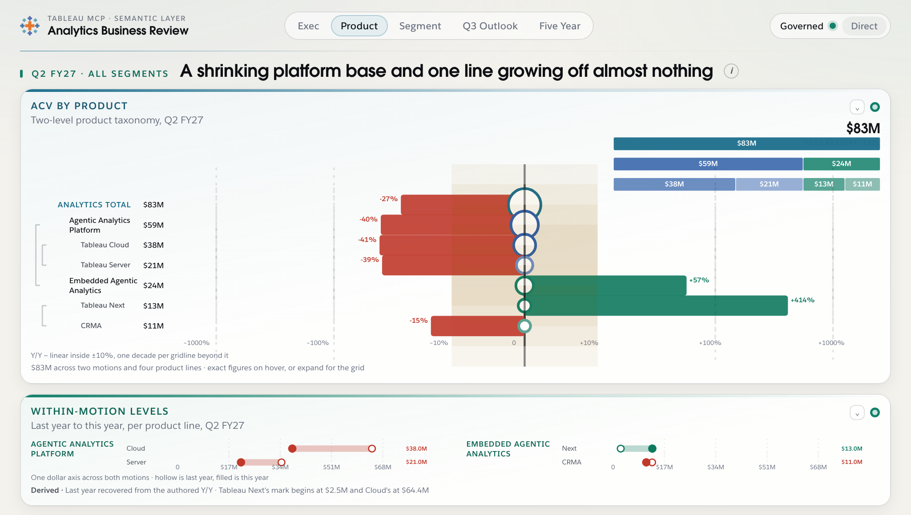

**Product · 1440x720**
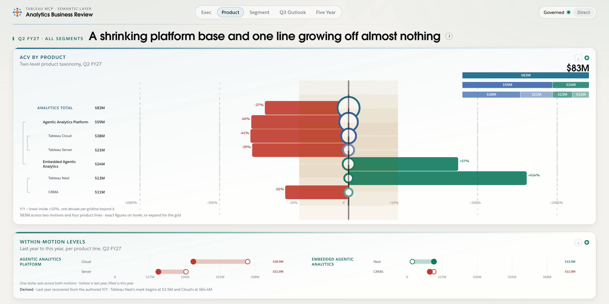

### 4.3 Alternative C — Delete the panel; fold the interval into the matrix

> **In three seconds:** the same 28 cells the tab is about, at half again the
> size, with each column's slowest-to-fastest interval drawn around them — and
> nothing on the tab spending a slot to redraw two cells it already holds.

Every cell in a matrix column shares one axis geometry, so the interval the
dumbbell draws is available as two hairlines down the column at the slowest
and fastest leaf rate, capped top and bottom. The span is stated in words in
the column head, where a heading is already being read. On the Product tab the
same move brackets each motion's rows and states the span on the motion's own
label.

The slot goes back to the matrix. On the Segment tab that is the whole side
column: the grid goes from 2.62fr to the full width. On the Product tab the
strip disappears and the matrix takes the full band height.

Two honest observations from the render. First, the intervals are so wide that
the brackets cover most of each column — which is the criticism of §1.1 drawn
rather than argued: an interval that spans nearly the whole axis in every
column is not discriminating between columns. Second, the Platform bracket on
the Product tab is a two-point sliver, and at this size that reads correctly as
"these two lines move together" for the first time, because it is no longer
competing for half a panel.

This is the cheapest option by a wide margin and needs no new data.

**Segment · 1024x580**
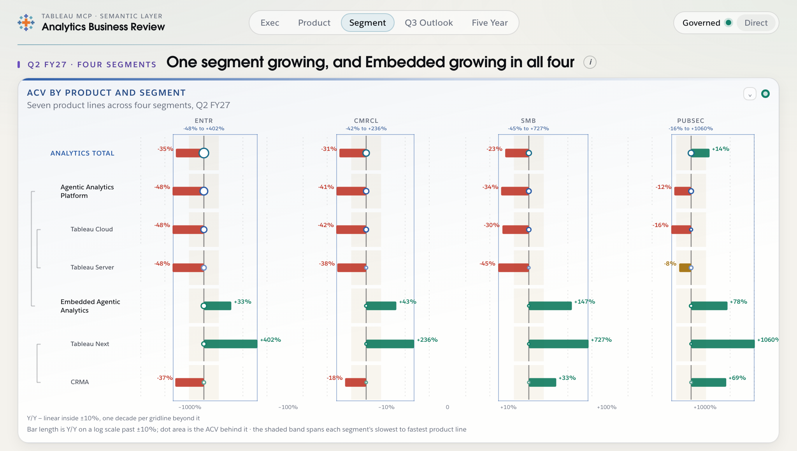

**Segment · 1440x720**
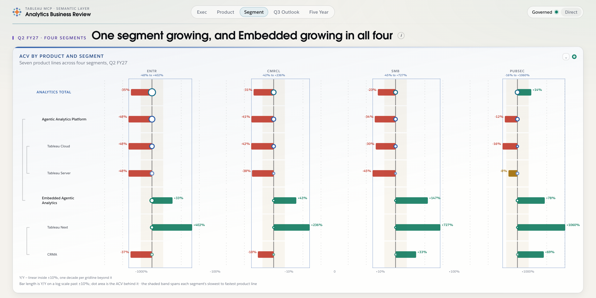

**Product · 1024x580**
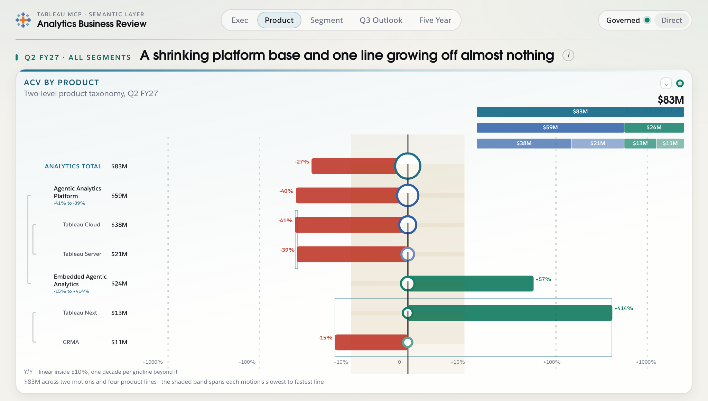

**Product · 1440x720**
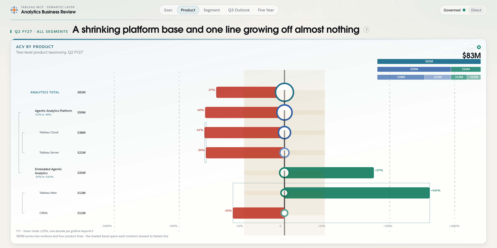

---

## 5. Recommendation: Alternative A, with C's matrix change taken alongside it

### 5.1 Why A

1. **It is the only one that adds a channel the board does not have.** Level
   and rate are on 28 cells already; movement is nowhere. B re-encodes level,
   which the matrix carries as dot area and as a hover figure. C adds nothing
   and removes a restatement. A answers criticism 1.2 outright.
2. **It rescues the panel's worst row.** Platform's −41% against −39% is a
   two-point stub occupying half the Product strip. As −$26.4M against
   −$13.4M it is a 2:1 comparison, legible at a glance, on the same slot. No
   other option changes what that row can say.
3. **It puts the panel on the right side of the board's own argument.** A
   difference of two non-additive rates becomes a decomposition of an additive
   certified measure. The rules flyover can point at this panel as the worked
   example instead of having to excuse it.
4. **It is better sourced live than what it replaces.** §6.1.
5. **It degrades better.** The current direct-mode story is that the intervals
   still draw over uncertified populations. A's is sharper and lands the same
   two theses: without a certified measure and a certified grouping, *the parts
   are not known to be the whole*, so the stack has nothing to be a
   decomposition of. That is T1 and T4 stated as an arithmetic failure rather
   than as a caption.
6. **It fits both placements from one grammar**, because the plot stretches
   rather than locking an aspect ratio. This is the main design risk the brief
   named and A is the alternative that dissolves it: the same four-row column
   and two-row strip come from one `preserveAspectRatio="none"` plot and two
   flex-direction rules, where the dumbbell needed two hand-tuned viewBoxes.

### 5.2 Why not B, and why not C alone

**B** is a good chart in the wide strip and a cramped one in the side column —
sixteen rows where there were five, on an axis set by the largest segment. It
also spends its main channel on a fact the matrix already encodes twice. It is
the right form if the panel's job is ever redefined as "how big is each line",
but that is not the job either tab needs.

**C** is genuinely defensible and is the correct fallback if no authoring
budget exists — it is a same-day change, it needs no new figures, and it makes
both tabs better by making the matrix bigger. What it does not do is give the
tab a second thing to say. On the Segment tab the reclaimed column is
~370px at 1440 spent on wider cells, which is real but modest.

### 5.3 Take C's matrix change regardless

The column bracket costs one wrapper div and two hairlines per column and it
preserves the dispersion reading that `seg-spread` exists for. Whichever panel
occupies the slot, folding the interval into the matrix means the min-to-max
reading is not lost when the dumbbell goes. Recommended alongside A.

---

## 6. Sourcing, and the authoring prerequisite

### 6.1 Live sourcing — the recommended form is better sourced than the current one

Everything Alternative A needs is a grouped two-year pull of one certified
additive measure:

- **The measure.** `ACV_clc` on `Sls_Forecasting_Metrics_Expanded`, already
  named by both portlets.
- **Prior year.** `Close_Date_Relative_Year_clc = 'PY'` on `ACV_HISTORICALS` —
  not a point-in-time snapshot but the `'PY'` rows of the same measure. This is
  the pattern `semantic-layer.md` already documents for `acv-account-fan`
  (lines 347, 408, 607) and it returns both years in one grouped query.
  Depth is not a constraint: only three years exist, and this needs two.
- **The segment columns.** Sourceable, FCST only, via the model owner's derived
  dimension `IF OU = Public Sector then OU else segment end` over `Segment10`
  (§10.2). Same derivation the matrix beside it depends on.
- **The product lines.** `APM_L120` / `APM_L218`, with the documented OR rule.

Two cautions, both pre-existing and neither introduced by this change:

- **The motion grouping on the Product tab has no governed dimension**
  (§1.4). Any grouped design in that slot inherits this.
- Do not add `Is_Current_Quarter_clc` to a grouped two-year pull — it
  double-counts (§2.5). For a partial quarter the QTD flag applies.

**Nothing in any of the three alternatives depends on data neither model can
supply**, beyond what the portlets already assume today.

### 6.2 What has to be authored before A can ship

Per §2.5, the renderer must not back-solve. Twenty figures, all of them exact
arithmetic over figures already in the file, authored as movements so the
panel never divides anything:

- `seg-spread.metrics` — 4 groups x 4 lines = **16 movements**
- `perf-divergence.metrics` — 2 groups x 2 lines = **4 movements**

Optionally also `priorValue` on the matrix rows, if the expand tables should
show last year. Sketch for one group:

```jsonc
{
  "id": "entr-move",
  "label": "ENTR",
  "netDisplay": "−$20.5M",
  "parts": [
    { "id": "cloud",  "label": "Tableau Cloud",  "short": "Cloud",  "delta": -14.77, "deltaDisplay": "−$14.8M" },
    { "id": "server", "label": "Tableau Server", "short": "Server", "delta":  -9.23, "deltaDisplay": "−$9.2M"  },
    { "id": "next",   "label": "Tableau Next",   "short": "Next",   "delta":   6.41, "deltaDisplay": "+$6.4M"  },
    { "id": "crma",   "label": "CRMA",           "short": "CRMA",   "delta":  -2.94, "deltaDisplay": "−$2.9M"  }
  ]
}
```

Then `node scripts/sync-fallback.mjs`, per the README.

**This is a `data/board.json` edit and this document does not make it.** Nor
does it touch `src/`, `styles/`, `index.html`, `README.md` or `docs/redesign.md`.

---

## 7. Where the two placements diverge, and where they must not

They share the grammar, the measure, the axis rule, the colour rule, the build
choreography and the renderer. They diverge in exactly three places, all of
which the existing `perf-side` block in `tabs.css` already establishes as the
house pattern for this panel:

1. **Stack direction.** Four groups down a column on the Segment tab; two
   groups across a strip on the Product tab. One `flex-direction` rule.
2. **Axis repetition.** Stacked, the groups sit on one ruler and only the last
   row prints it. Turned into a row they no longer share an x position, so each
   strip prints its own.
3. **Domain.** The Segment panel runs −$28M to +$8M (its largest loss wing is
   ENTR's $26.9M); the Product panel runs −$42M to +$12M (Platform's $39.8M).
   These are different scopes, not different scales for the same numbers, and
   both are shared across every group *within* their panel — which is the
   property that makes the panel a comparison.

The row count difference is why A is preferred over B on this axis
specifically: A's row count equals the group count (4 and 2), where B's equals
the line count (16 and 4).

---

## 8. Implementation estimate

Against the existing renderers, for Alternative A plus §5.3.

| work | size | notes |
| --- | --- | --- |
| `src/charts/growthContribution.js` | new, ~300 lines | Replaces `growthSpread.js` (426). Simpler: no symlog import, no two plot boxes, no severed-stem geometry. Keeps the DOM-label-over-stretched-SVG pattern and the expand table. |
| Register in `src/charts/index.js` | 1 line | |
| `data/board.json` | 20 authored movements + `kind` | §6.2, then `sync-fallback.mjs`. |
| `styles/portlets.css` | ~120 lines swapped | `.spread*` out, `.contrib*` in. Similar size. |
| `styles/tabs.css` | ~25 lines edited | The `perf-side` block adapts; the plot cap replaces the `max-width: 360px` aspect workaround. |
| Matrix bracket (§5.3) | ~35 lines in `growthMatrix.js` + ~20 CSS | One wrapper grid item per column plus two hairlines. |
| Direct-mode path | ~25 lines | New degradation (§5.1.5); existing `directMode` blocks need new `effect`/`metrics.caption` copy. |
| Veil + build sequence | ~30 lines | Four beats: rule and axis, loss wing left-to-right, gain wing, then net and footnotes. Every conditional mark in the veil list; `settle()` as written. |

**Estimate: one day**, plus a short authoring pass on the twenty figures and
the direct-mode copy. Alternative C alone is roughly two hours, is a strict
subset, and is the right thing to ship first if the authoring pass has to wait.

One implementation note worth carrying over, learned building the mockups: an
absolutely positioned grid child with `grid-row: 1 / -1` does **not** get the
grid area as its containing block — `-1` resolves to the container's padding
edge, which puts every column's bracket on the first column's axis. Use a real
grid item as the wrapper, or an explicit end line.

---

## 9. Build log — where the build departed from this spec

A and C were both approved and built. Five things changed on contact with the
real boxes, and they are recorded here rather than quietly folded back into the
sections above.

### 9.1 The boxes are not the ones the mockups assumed

The exploration mockups sized both placements by hand off `docs/redesign.md`.
Measured off the running board instead — `docs/mockups/spread/final/measure.html`
loads `index.html` in an iframe and reads the portlet bodies — they are:

| | segment column | product strip |
| --- | --- | --- |
| 1024×580 | 249 × 420 | 951 × 83 |
| 1280×620 | 312 × 466 | 1190 × 88 |
| 1440×720 | 342 × 531 | 1334 × 90 |

Two surprises. The segment column is **420px, not the ~300 the mockups
assumed**: the rules cards are flyovers rather than band members, so each panel
has its band to itself. And the product strip is **83px** and gains 7px between
1024 and 1440, so it is the constraint on the whole design — anything costing a
line there costs it at every size.

### 9.2 The strip does not turn its rows into a row

§7 expected the strip to place its groups side by side, as the dumbbell did.
It does not. The dumbbell could: its plots were drawn on the scale-free symlog
from `growth.js`, so two intervals were comparable at whatever width they
landed. This panel's scale is a dollar domain authored per portlet, and its
first job is the comparison *between* groups — which needs one centre rule at
one offset with one ruler under it, and that is a stack.

So both placements stack, and the divergence is smaller than §7 predicted:
**only the position of the group's name differs.** Above its bar in the 249px
column, beside it in the 951px strip, where two stacked lines in a name gutter
buy back the 26px the strip does not have. Both from `data-layout` on the band.

### 9.3 The exact figures are written out under every bar

Unanticipated, and it is the part that most changes how the panel reads. On a
scale shared across four segments, Enterprise's losing wing is 21× PubSec's —
the honest result, and the argument for dollars, but it leaves three of the
four rows carrying the cross-segment comparison and little else. So each row
names its pieces with their movements underneath: the bar answers "how much,
against the other segments", the line answers "which lines, exactly".

This also absorbed the segment column's slack, which was 187px before it.

### 9.4 The ±10% band and the caret are not explained — they are gone

§4.1 proposed explaining them. Better: neither mark exists here. A dollar scale
has no soft band to tint (`toneOf` is called with `softBand: 0`, so sign alone
decides tone) and there is no parent-rate caret to name. What is left needing
explanation is which side of the rule is which and what orders the pieces, and
that is two chips and six words sitting above the axis in the panel — not in a
neighbouring portlet's `axisNote`, and not in a footer below the fold. The
strip drops the key entirely: its wings are one or two named pieces, so there
is no ordering a reader could get wrong.

### 9.5 The axis rule is a div, not a border

Drawn as `border-top` on the tick strip it cannot join the veil: `veil()` works
on opacity, and opacity on a parent multiplies through its children, so the
rule either flashes at mount alone or takes the tick labels down with it and
they can never be revealed on their own beat. It is its own element for that
reason and no other.

### 9.6 The module is `groupMovement.js`, not `growthContribution.js`

§8 priced this as `src/charts/growthContribution.js`. It shipped as
`src/charts/groupMovement.js`, because the panel is no longer a member of the
`growth*` family in any sense that matters: it shares no scale with them, does
not import `growth.js`, and its measure is dollars rather than a rate. Keeping
the prefix would have implied the symlog axis it exists to get away from.
`docs/mockups/direct/direct-mode-blocks.json` has a placeholder naming the old
filename — that agent's `_placeholder` defers this portlet's degraded copy to
this build, and the `directMode` blocks it is waiting on are authored.

### 9.7 Two rows' rounded parts do not add to their rounded net

Not a reconciliation problem, and not one of the three routed around in §3: the
arithmetic is exact, `net == sum(parts)` to a residual of 0.00 on all six rows.
It is display precision. Every figure prints to $0.1M and each net is rounded
from the exact sum, so PubSec shows `+1.8 +1.2 −0.8 −0.5` against a net of
`+$1.8M` — the parts foot to 1.7 as printed and to 1.77 in fact. Embedded is
the same at 8.6 against `+$8.5M`.

This mattered enough to address because additivity is the panel's whole
argument: four figures that visibly do not add to the total beside them argue
against the thing the panel is for. It is also self-inflicted, arriving with
the figures line of §9.3, which the spec did not have.

Three fixes were considered and two rejected. Largest-remainder rounding across
each row's parts would make the printed figures foot, at the cost of printing
one part 0.1 off its own exact value — which is altering a figure to make a
sum work, the failure this whole document is a reaction to. Printing two
decimals buys closure at a precision no reader of an executive card wants.

What shipped: every figure stays exact, and the expand's `detailNote` states
the precision — that figures are shown to $0.1M and each net is rounded from
the exact sum. That is a fact about rounding rather than commentary on a
source disagreement, so it does not breach the no-reconciliation-UI rule; and
it sits in the expand beside the full four-column table, not on the card.

### 9.8 `bulletTrack` was checked and not used

`attainment.js` now exports a generalized `bulletTrack`, and both of this
build's marks were checked against it. Neither can use it: it models a value
against a plan on a one-sided 0–110 domain with threshold bands and a target
at 100. The movement panel is a signed decomposition on a two-sided dollar
domain with no target and no bands, and the bracket is two positioned
hairlines with no value at all. Sharing the primitive would have meant
disabling most of it in both callers.

---

## 10. Files this document owns

- `docs/spread-redesign.md` — this file
- `docs/mockups/spread/` — the exploration: `kit.css`, `kit.js`, six HTML
  pages, twelve PNGs, `shoot.sh`
- `docs/mockups/spread/derive-movements.py` → `movements.json` — the 20
  movements, derived and checked, staged for the `board.json` paste
- `docs/mockups/spread/staging/apply-data.py` — the `board.json` and catalog
  edit, kept as a runnable idempotent script rather than done by hand, because
  both files were held by other agents and a scripted edit shrinks the window
  in which this one holds them

The renderer and the two stylesheets were drafted in `staging/` too, while the
shared files were held, and were deleted from it once they landed in `src/` and
`styles/`. A second copy of a 498-line renderer in a docs folder is not a
record of anything — it is a file that will drift from the one that runs, and
be read by someone as though it had not.
- `docs/mockups/spread/final/` — `measure.html`, `preview.html`, `shoot.sh`,
  `audit.html`, `direct.html`, `probe-bracket.html` and the verification shots

### Verifying the right tab, which is not automatic

`shoot.sh`, `audit.html` and `direct.html` all assert the rendered tab against
the tab requested, and fail loudly rather than returning a frame. They have to:
the router falls back to `exec` for any hash it does not recognise, silently,
so `#/perf` and `#/seg` — which are not tab ids — screenshot the exec tab and
pass. The real ids are `exec`, `analytics-performance`,
`performance-by-segment`, `q3-outlook`, `trend`. This build's own `shoot.sh`
hit the same failure a second way, by appending its cache-buster after the
fragment and turning a valid id into an invalid one.

The assertion is on `.panel.is-active` and on that panel's own
`.panel-headline`. Scoping matters: every tab's panel is in the DOM at once, so
an unscoped `h2` selector returns the exec headline whichever tab is showing,
which is the same trap one layer down.

`audit.html` also measures clipping, and its first implementation was wrong in
a way worth recording. It cloned each `.portlet-body` at `height: auto` to read
a natural height — but a clone has to be appended somewhere, and appended to
`document.body` it sits outside `.panel` and `.band`, losing `--bar-h`, the tab
grid and every band override. It reported all six frames clipped by 57–407px
while the screenshots were plainly clean. It now asks the descendants where
their painted boxes actually are, which needs no clone and no second cascade.

The exploration mockups import nothing from `src/`. `final/preview.html` does,
read-only and through an import map, so that the marks, the palette and the
veil contract under test are the shipped ones rather than transcriptions of
them — which is what made §9.1 through §9.5 findable before the panel went
anywhere near the board. Serve the repo root on `:8899` and run
`bash docs/mockups/spread/final/shoot.sh out.png 1024 580`.
